|  | Pemrograman Mobile |
|--|--|
| NIM |  244107020109|
| Nama |  Aisya Aswy Nur Aidha |
| Kelas | TI - 3H |

# WEEK 2
## Declarative UI & Responsive Design

### Demo
1. Jalankan aplikasi hasil akhir pada emulator ukuran ponsel (misal 5"), lalu tablet (misal 10"); bandingkan jumlah kolomnya.
 - Tampilan layar 5 inch dengan resolusi 800 x 480 piksel
    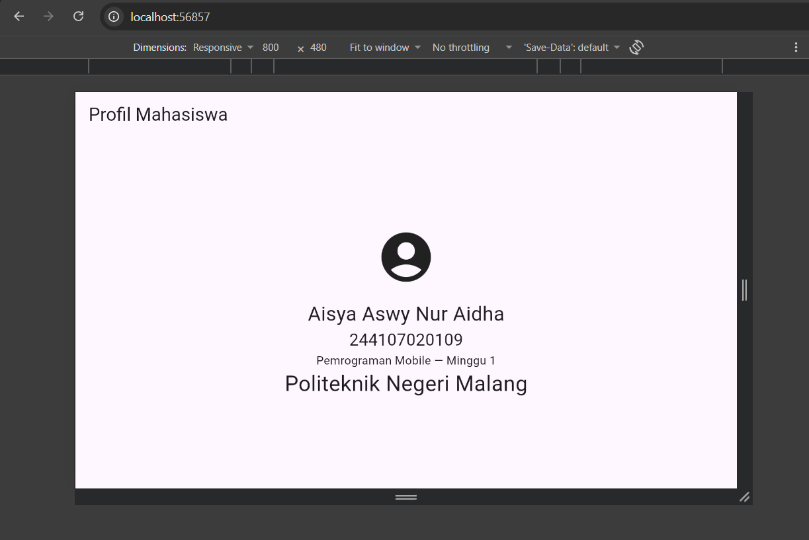
 - Tampilan layar 10 inch dengan resolusi 1280 x 800 piksel
    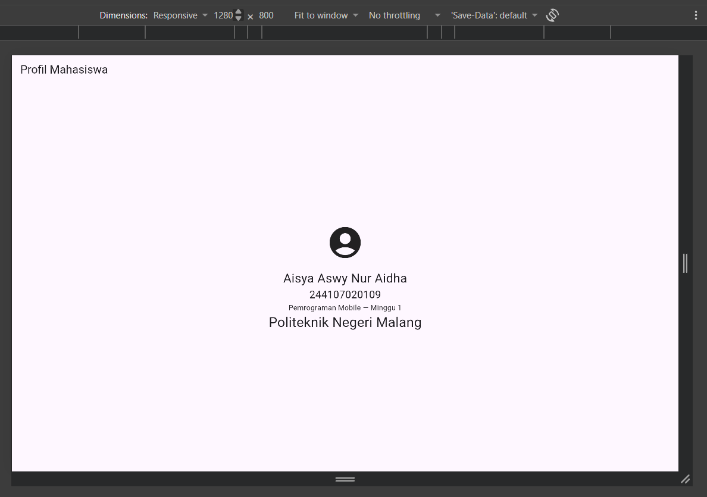

2. Aktifkan dark mode pada emulator/perangkat dan amati perubahan tema secara otomatis.
- Tampilan pada aplikasi web berubah secara otomatis karena kode aplikasi sudah menerapkan styling untuk dark mode dengan menambahkan kode berikut     
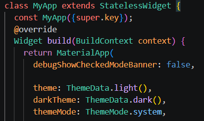
 - Tampilan ketika dark mode
    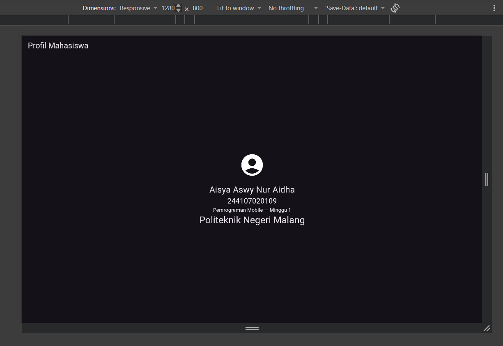

### Praktikum: Layout Sederhana (Warm-up)
Membuat widget dasar berupa kartu profil sederhana dengan mengganti isi lib/main.dart pada project minggu sebelumnya. Tampilan card
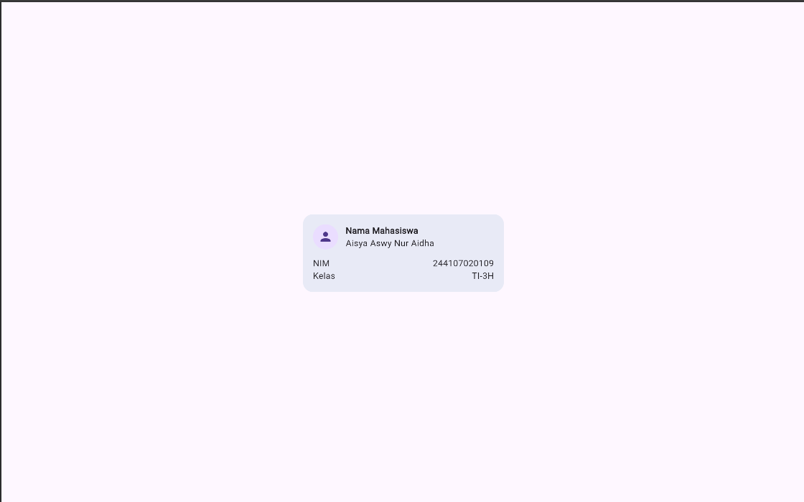

##### Eksperimen warm-up
1. Hapus Expanded pada baris nama, lalu amati peringatan overflow atau perilaku layout-nya; kembalikan setelah itu.
- Peringatan yang terjadi ketika expanded pada baris nama dihapus
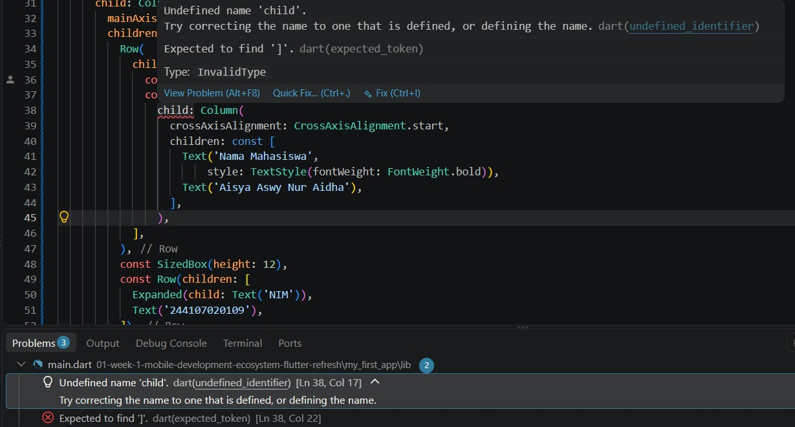
saat baris expanded dihapus, terjadi error sintaks "undefined name 'child' pada editor", tanpa expanded layout menjadi tidak responsif terhadap teks yang panjang, lalu setelah expanded dikembalikan, column akan kembali mengambil sisa ruang pada row secara fleksibel untuk mencegah potensi overflow.
lalu jika kode dibenahi akan menjadi berikut
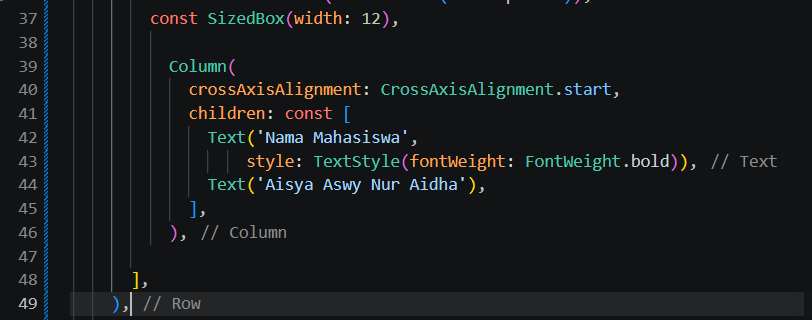
lalu tampilan halaman akan menjadi seperti berikut
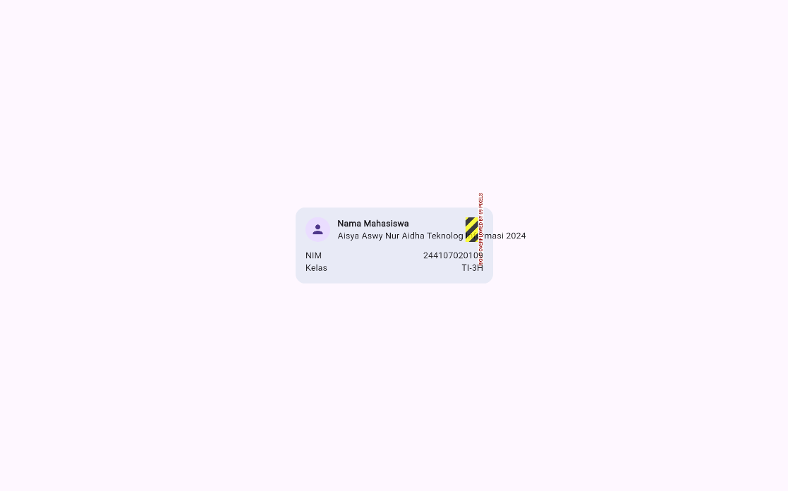

2. Ganti mainAxisSize: MainAxisSize.min menjadi nilai default dan amati perubahan tinggi kartu.
- Nilai default dari `mainAxisSize: MainAxisSize.min,` yaitu `mainAxisSize: MainAxisSize.max,` dan perubahan tampilan pada halaman web
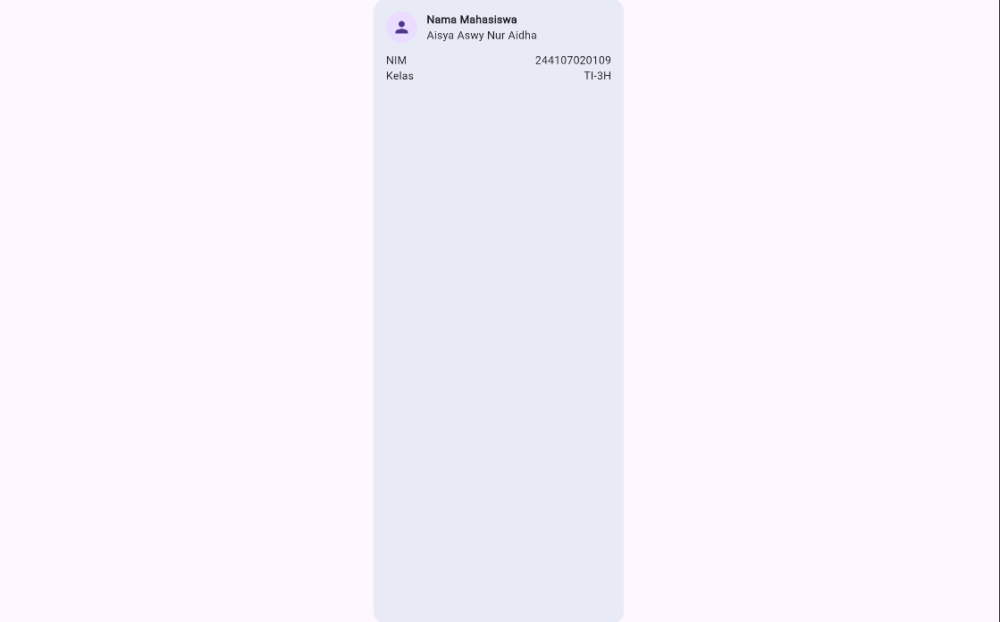
ketika diubah ke nilai default, tinggi kartu profile berubah menjadi sangat tinggi hingga memenuhi seluruh layar secara vertikal, terjadi karena `mainAxisSize: MainAxisSize.max,` memaksa kolom untuk mengambil ruang vertikal sebesar mungkin yang tersedia pada layar, berbeda dengan nilai awal yang akan membuat tinggi kartu hanya seukuran dengan tinggi konten di dalam.
3. Tambahkan satu baris data (misal Email) menggunakan pola Row + Expanded yang sama.
- Kode tambahan untuk menambahkan baris email
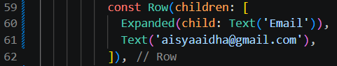

- Hasil tampilan pada halaman 
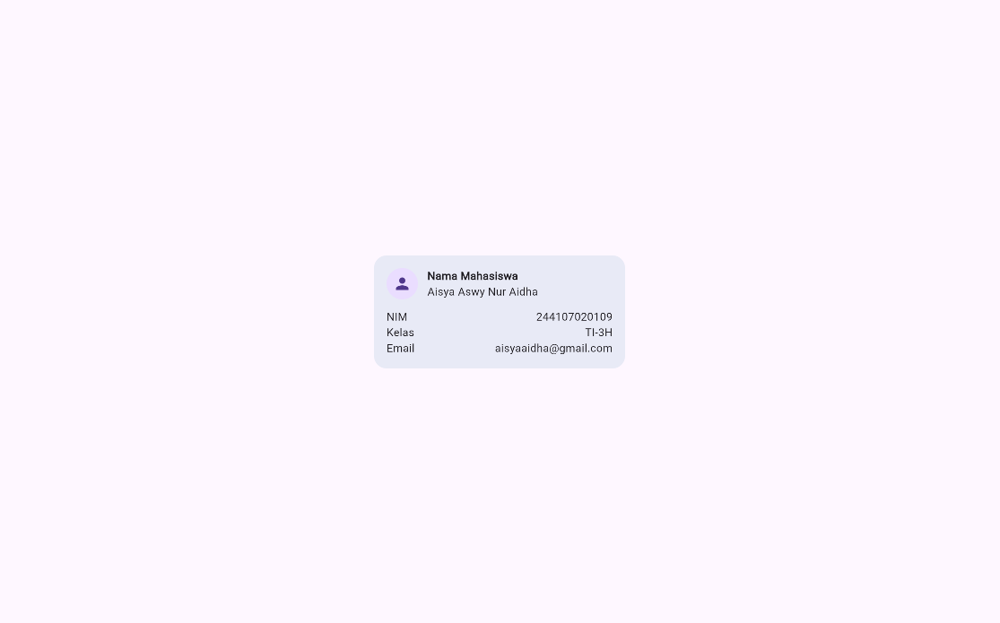

### Praktikum: Dashboard Responsif

#### Menyiapkan Project
- flutter create responsive_dashboard
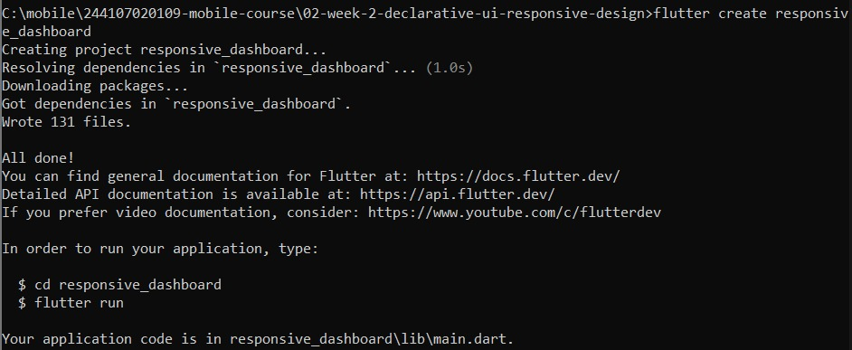
- cd responsive_dashboard
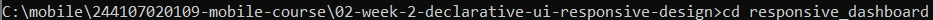
- flutter run
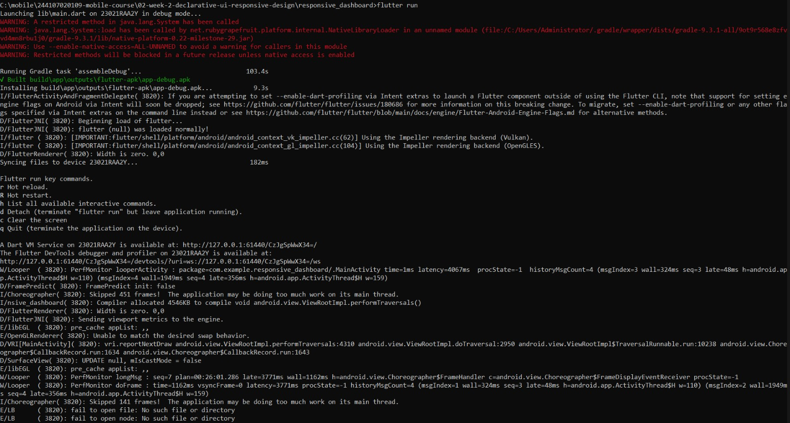


Membuat aplikasi profil sederhana dan hasil run kode program
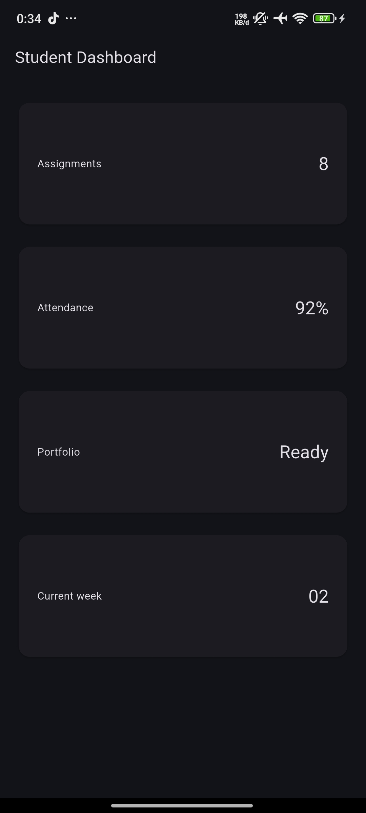

#### Menambahkan interaksi: StatefulWidget dan Cupertino
Mengubah `DashboardApp` menjadi `StatefulWidget` dan menambahkan `CUpertinoSwitch` (widget Cupertino), tampilan akan berubah menjadi seperti berikut
- lightmode
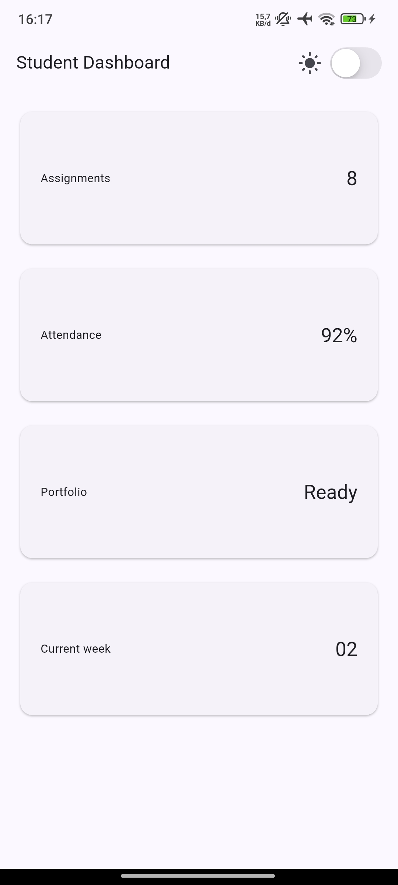

- darkmode
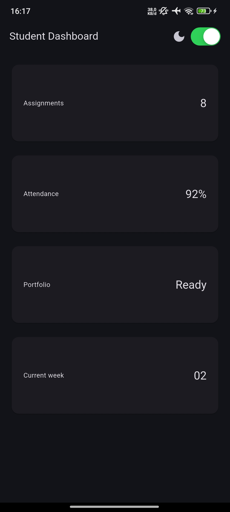

`CupertinoSwitch` akan menampilkan tombol switch bergaya iOS secara konsisten pada seluruh platform, tetapi harus mengimport library cupertino.dart, sedangkan `Switch.adaptive` merupakan pendekatan yang lebih responsif secara platform material. Saat dijalankan di iOS/macOS, Flutter secara otomatis merender style Cupertino, sedangkan pada saat menggunakan Android/Windows, akan menggunakan style Material tanpa perlu kamu ubah kodenya.

#### Eksperimen Layout
1. Ubah breakpoint dari 700 menjadi nilai lain dan amati perubahan jumlah kolom.
- Jika breakpoint dirubah menjadi nilai 300, tampilan akan menjadi 
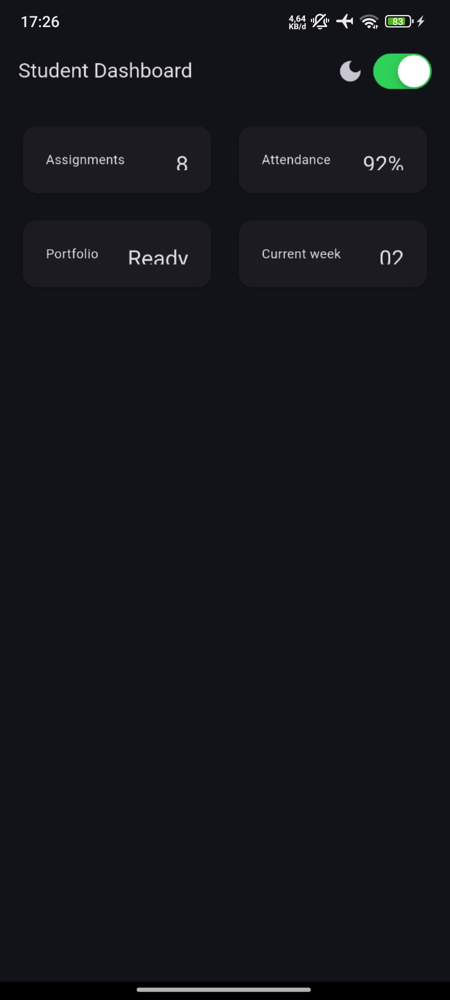
nilai breakpoint berfungsi sebagai ambang batas lebar layar untuk menentukan pergantian jumlah kolom, dengan mengubah nilai breakpoint menjadi 300 akan membuat layar HP (lebar layar diatas 300 piksel) beralih ke tampilan 2 kolom. Sedangkan saat nilai breakpoint 700 akan menampilkan 2 kolom jika layar memiliki lebar lebih dari 700 piksel seperti tablet/laptop.
2. Ubah themeMode menjadi ThemeMode.dark, lalu kembalikan ke ThemeMode.system.
- Kode yang diubah menjadi `ThemeMode.dark` 
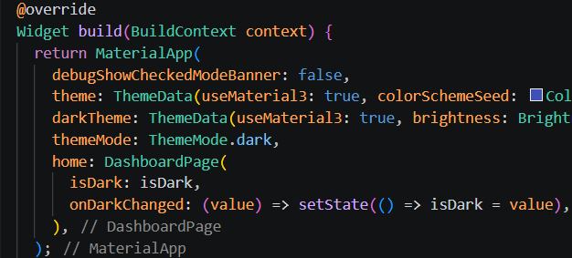
dan tampilan akan berubah menjadi
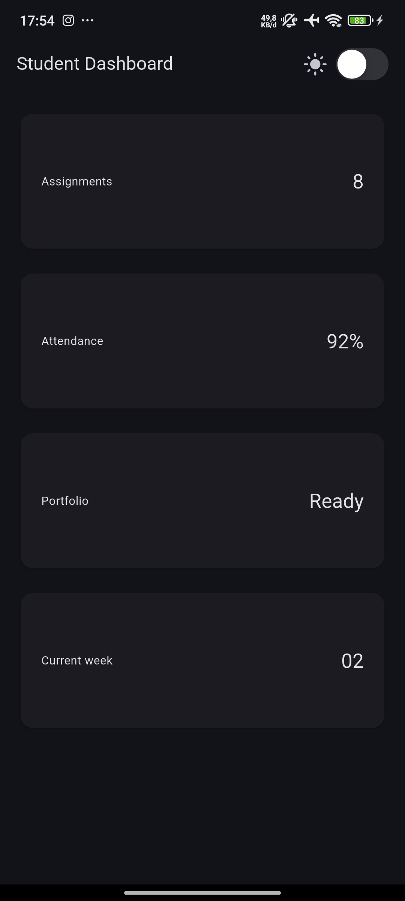
dimana pada saat tombol switch menunjukkan light mode aplikasi tetap akan menampilkan dark mode karena dipaksa di dark mode secara terus menerus dan switch menjadi tidak berpengaruh.
- Kode yang diubah menjadi `ThemeMode.system`
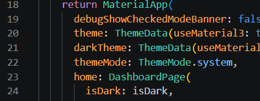
dan tampilan akan menjadi

dimana ketika kode diubah menjadi `ThemeMode.system` tampilan aplikasi akan otomatis mengikuti setelan tema bawaan pada browser/HP.
3. Uji aplikasi dengan ukuran layar emulator yang berbeda.
- Tampilan jika membuka aplikasi pada emulator lain, dengan lebar 10 inch.
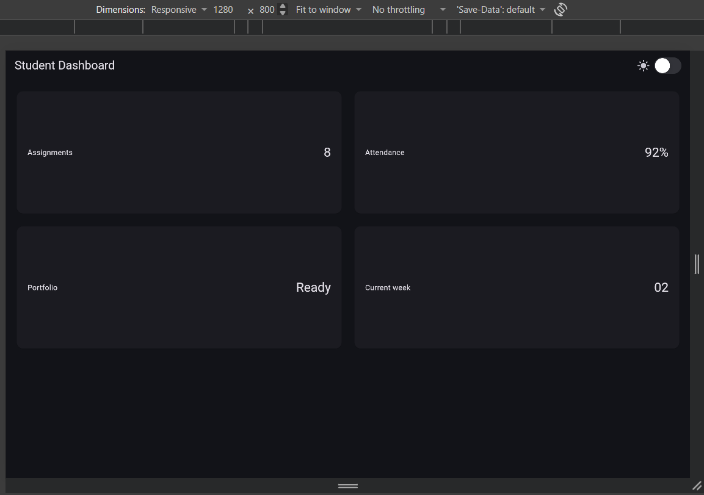
4. Tambahkan Semantics atau label yang bermakna pada elemen yang penting bagi screen reader.
- Terdapat penambahan semantics pada beberapa elemen berikut
   1. Penandaan Judul Halaman (AppBar Title)
   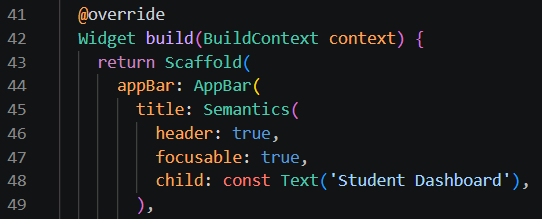
   `header: true` akan memberi tahu screen reader bahwa elemen ini merupakan judul utama dari halaman, `focusable: true` memastikan screen reader dapat menghentikan kursor fokus pada teks judul saat menggunakan tab.
   2. Pengelompokkan DashboardCard
   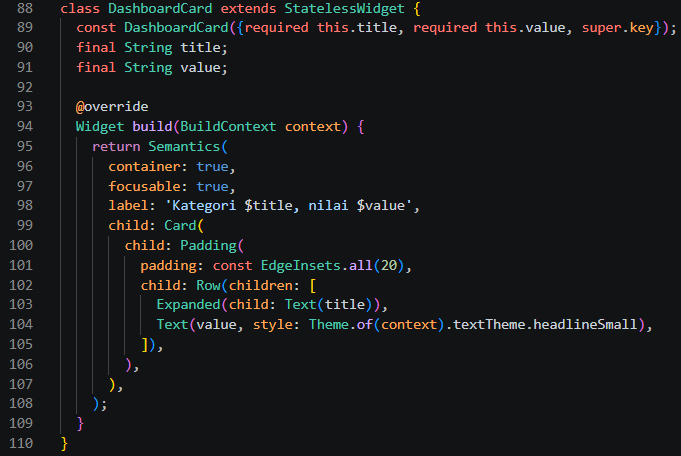
   setiap komponen card dibungkus menggunakan semantics, dengan begitu screen reader dapat menyampaikan informasi secara utuh dan jelas dalam satu kalimat.
   3. Komponrn CupertinoSwitch
   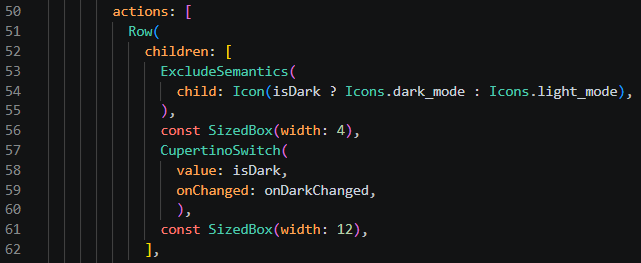
   elemen saklar sudah dikenali oleh screen reader sistem operasi sebagai komponen toggle switch, saat difokuskan dan diubah statusnya oleh pengguna, screen reader akan memberikan konfirmasi status komponen secara otomatis. Lalu terdapat juga `ExcludeSemantics` yang berfungsi agar screen reader mengabaikan ikon hiasan di samping switch tema dan mencegah screen reader membaca informasi ganda yang tidak diperlukan.

### Tugas dan AI Design Exploration

#### Tugas Utama
Halaman Academic Overview
- Memiliki header profil dan minimal empat kartu informasi.
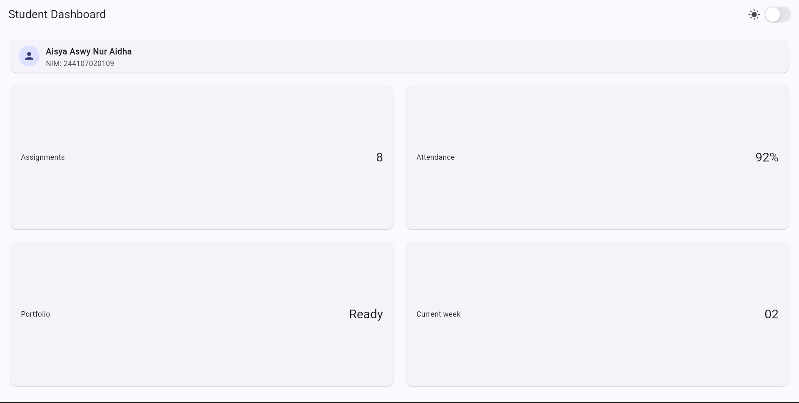
- Menampilkan satu kolom pada layar sempit dan dua kolom pada layar lebar.

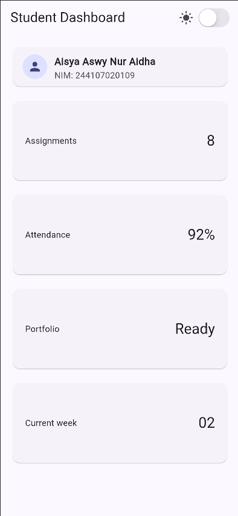
- Menyediakan light theme dan dark theme yang tetap terbaca, dengan toggle tema (misal CupertinoSwitch atau Switch.adaptive).


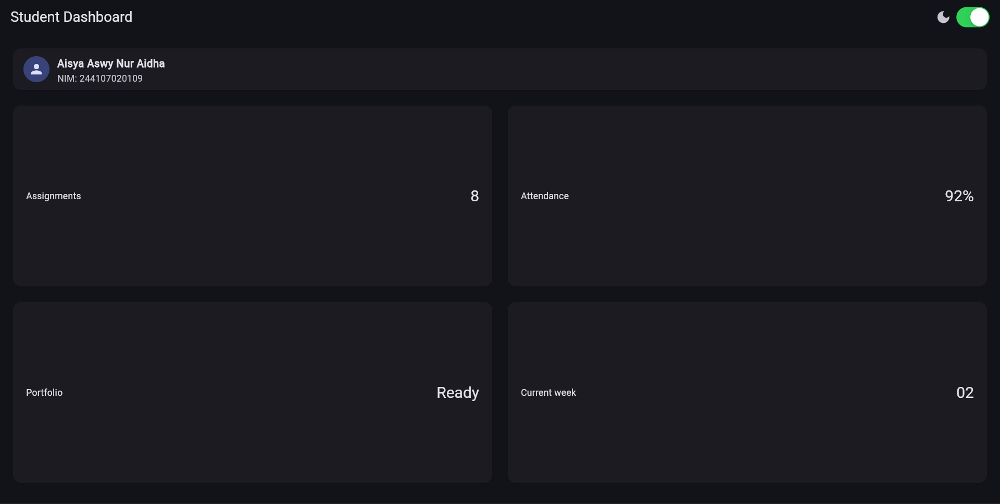

#### AI Prompt Challenge
1. Prompt desain. Ajukan prompt ini (atau variasinya): "Bandingkan dua tata letak dashboard akademik untuk Flutter: versi GridView dan versi LayoutBuilder + Column. Jelaskan trade-off responsif dan aksesibilitasnya."
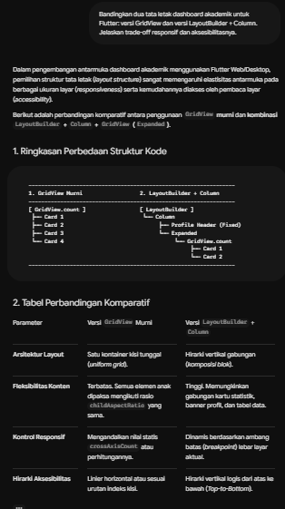
2. Prompt penguatan konsep. "Jelaskan kapan penggunaan Expanded justru menyebabkan overflow di dalam Row, beri contoh kode yang gagal dan perbaikannya."
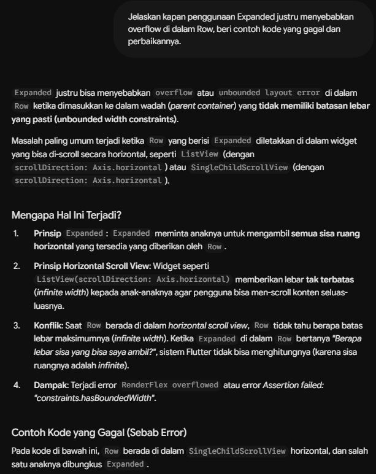
3. Verification prompt. Minta AI mengaudit hasilnya sendiri: "Periksa kembali rekomendasi layout di atas: apakah tetap responsif di bawah 600px, apakah mengurangi aksesibilitas, dan apakah ada widget yang tidak tersedia di Flutter stabil saat ini?"
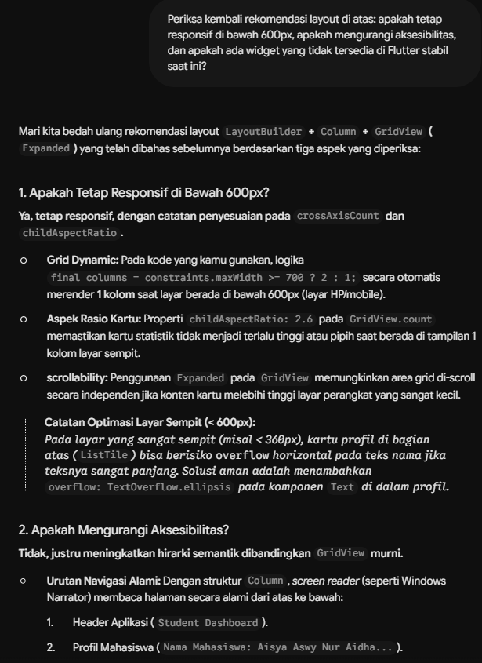
4. Dokumentasikan. Simpan prompt, output penting, keputusan yang dipilih, alasan teknis, dan bukti verifikasi (test/screenshots) di README tugas minggu ini.
- Berdasarkan jawaban dari prompt yang telah dilakukan, penggunaan tata letak dashboard versi LayoutBuilder + Column merupakan pilihan yang lebih disarankan, karena memberikan kontrol penuh terhadap perubahan responsif layar sekaligus menjaga urutan pembacaan screen reader tetap rinci dan logis. Kode saya juga menggunakan versi LayoutBuilder + Column untuk dashboard, sudah responsif pada ukuran layar dan tidak menurunkan aksesibilitas.
```dart
import 'package:flutter/material.dart';
import 'package:flutter/cupertino.dart';

void main() => runApp(const DashboardApp());

class DashboardApp extends StatefulWidget {
  const DashboardApp({super.key});

  @override
  State<DashboardApp> createState() => _DashboardAppState();
}

class _DashboardAppState extends State<DashboardApp> {
  bool isDark = false;

  @override
  Widget build(BuildContext context) {
    return MaterialApp(
      debugShowCheckedModeBanner: false,
      theme: ThemeData(useMaterial3: true, colorSchemeSeed: Colors.indigo),
      darkTheme: ThemeData(useMaterial3: true, brightness: Brightness.dark, colorSchemeSeed: Colors.indigo),
      themeMode: isDark ? ThemeMode.dark : ThemeMode.light,
      home: DashboardPage(
        isDark: isDark,
        onDarkChanged: (value) => setState(() => isDark = value),
      ),
    );
  }
}

class DashboardPage extends StatelessWidget {
  const DashboardPage({
    required this.isDark,
    required this.onDarkChanged,
    super.key,
  });
  final bool isDark;
  final ValueChanged<bool> onDarkChanged;

  @override
  Widget build(BuildContext context) {
    return Scaffold(
      appBar: AppBar(
        title: Semantics(
          header: true,
          focusable: true,
          child: const Text('Student Dashboard'),
        ),
        actions: [
          Row(
            children: [
              ExcludeSemantics(
                child: Icon(isDark ? Icons.dark_mode : Icons.light_mode),
              ),
              const SizedBox(width: 4),
              CupertinoSwitch(
                value: isDark,
                onChanged: onDarkChanged,
                ),
              const SizedBox(width: 12),
            ],
          ),
        ],
      ),
      body: LayoutBuilder(
        builder: (context, constraints) {
          final columns = constraints.maxWidth >= 700 ? 2 : 1;

          return Column(
            children: [
              Padding(
                padding: const EdgeInsets.fromLTRB(16, 16, 16, 0),
                child: Semantics(
                  container: true,
                  focusable: true,
                  label: 'Nama Mahasiswa: Aisya Aswy Nur Aidha, NIM: 244107020109',
                  child: const Card(
                    child: ListTile(
                      leading: CircleAvatar(
                        child: Icon(Icons.person),
                      ),
                      title: Text(
                        'Aisya Aswy Nur Aidha',
                        style: TextStyle(fontWeight: FontWeight.bold),
                      ),
                      subtitle: Text('NIM: 244107020109'),
                    ),
                  ),
                ),
              ),
              Expanded(
                child: GridView.count(
                  padding: const EdgeInsets.all(16),
                  crossAxisCount: columns,
                  crossAxisSpacing: 16,
                  mainAxisSpacing: 16,
                  childAspectRatio: 2.6,
                  children: const [
                    DashboardCard(title: 'Assignments', value: '8'),
                    DashboardCard(title: 'Attendance', value: '92%'),
                    DashboardCard(title: 'Portfolio', value: 'Ready'),
                    DashboardCard(title: 'Current week', value: '02'),
                  ],
                ),
              ),
            ],
          );
        },
      ),    
    );
  }
}

class DashboardCard extends StatelessWidget {
  const DashboardCard({required this.title, required this.value, super.key});
  final String title;
  final String value;

  @override
  Widget build(BuildContext context) {
    return Semantics(
      container: true,
      focusable: true,
      label: 'Kategori $title, nilai $value',
      child: Card(  
        child: Padding(
          padding: const EdgeInsets.all(20),
          child: Row(children: [
            Expanded(child: Text(title)),
            Text(value, style: Theme.of(context).textTheme.headlineSmall),
          ]),
        ),
      ),
    );
  }
}
```
#### Refactoring Challenge
1. Ekstrak kartu informasi menjadi widget reusable (misal InfoCard) yang menerima title dan value, sehingga tidak ada duplikasi widget.
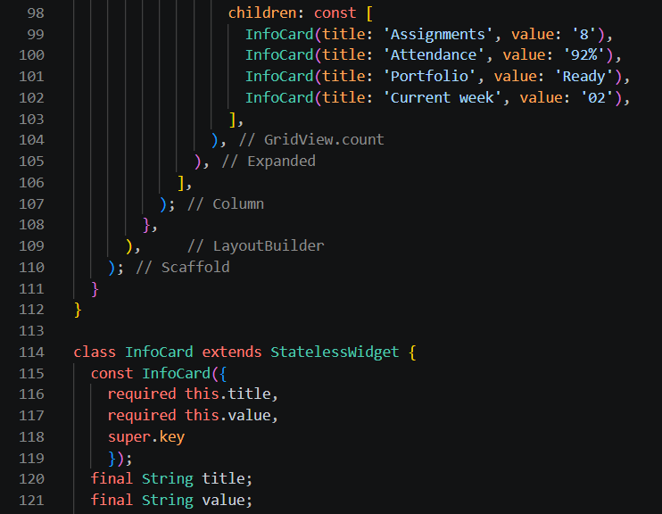
2. Ganti warna dan ukuran yang di-hardcode dengan Theme.of(context) agar mengikuti tema terang/gelap secara otomatis.
- Merubah kode pada tampilan card, membuat tampilan angka statistik menjadi warna primary theme 
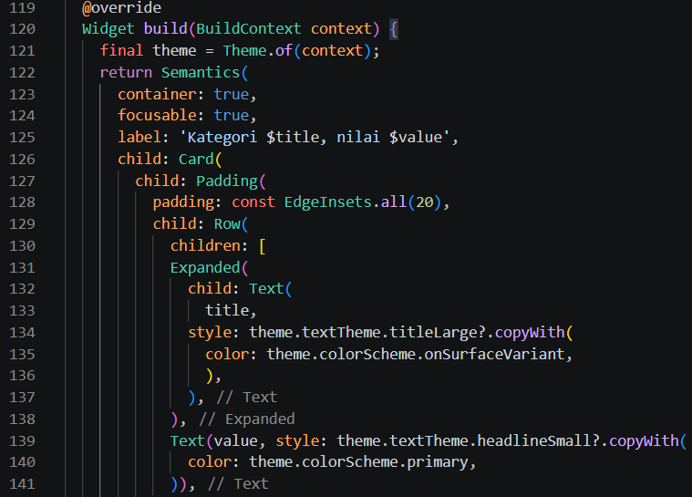
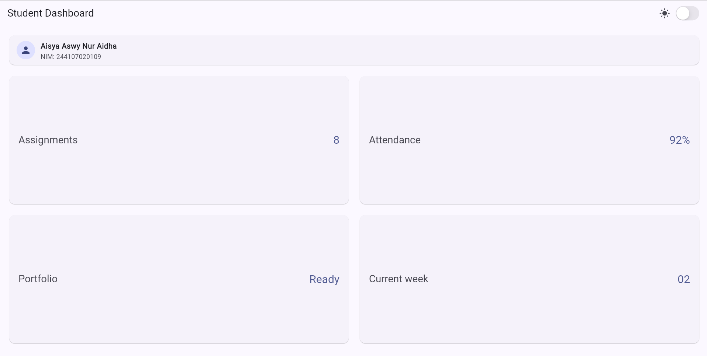
3. Pindahkan breakpoint ke satu konstanta bernama (misal const kWideBreakpoint = 700;) agar hanya didefinisikan satu kali.
`const double kWidthBreakpoint = 700;`
```dart
      body: LayoutBuilder(
        builder: (context, constraints) {
          final columns = constraints.maxWidth >= kWidthBreakpoint ? 2 : 1;
```
4. Jalankan flutter analyze dan pastikan tidak ada error maupun warning baru.
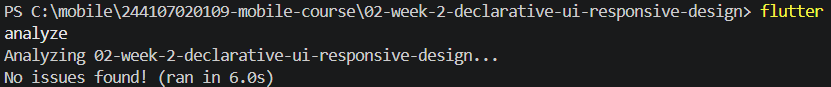

#### Testing Dasar
Menambahkan widget test di folder test/ untuk memverifikasi perilaku responsif. Override ukuran layar menggunakan `tester.view`
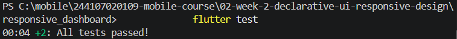

#### Checklist Verifikasi
- flutter analyze tidak menghasilkan error.

- flutter test lulus semua widget test responsif.

- Aplikasi dapat dijalankan pada ukuran layar sempit dan lebar.


- Dark mode memiliki kontras dan teks yang terbaca.
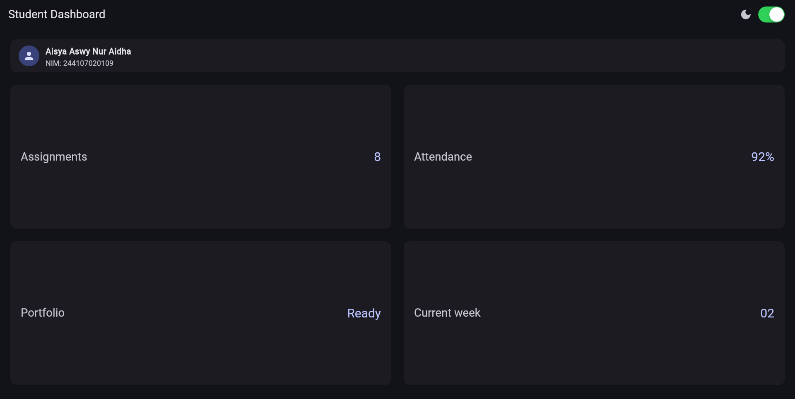
- Screenshot, folder test/, dan README sudah tersimpan pada folder tugas Week 2.
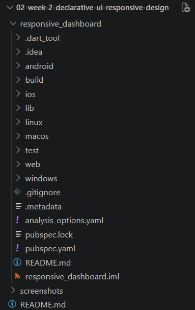

### Refleksi 
1. Apa perbedaan cara berpikir imperative dan declarative saat membangun UI?
- Cara berpikir imperative lebih berfokus pada bagaimana, dimana terdapat intruksi langkah demi langkah kepada sistem untuk mengubah tampilan secara manual. Cara kerjanya dengan mencari komponen visual yang ada pada layar terkebih dahulu lalu menmutasi propertinya secara langsung.
- Cara berpikir declarative hanya perlu menggambarkan atau mendeskripsikan kondisi UI berdasarkan state saat itu. Cara kerjanya ketika state berubah, flutter secara otomatis membangun ulang tampilan sesuai deskripsi baru.
2. Kapan Expanded membantu dan kapan penggunaannya justru menghasilkan layout error?
- Expanded membatu saat ingin membuat widget child mengisi sisa ruang kosong yang tersedia di dalam widget fleksibel. Akan menghasilkan layout error ketika membungkus expanded di dalam widget yang sudah tidak memiliki batas ukuran atau memakai expanded langsung diluar row/column/flex.
3. Bagaimana breakpoint dan theme memengaruhi pengalaman pengguna?
- Breakpoint
Memastikan tata letak UI menyesuaikan perangkat,contoh ketika menggunakan layar sempit maka akan muncul 1 kolom dan ketika menggunakan layar lebar akan menampilkan 2 kolom. Juga mencegah teks terpotong, tombol terlalu kecil, atau munculnya overflow garis kuning hitam saat menggunakan layar yang lebar.
- Theme
Memudahkan pengguna membaca di berbagai kondisi pencahayaan, juga memastikan seluruh tombol, warna teks, dan latar belakang menggunakan palet warna yang seragam.
4. Apa yang Anda verifikasi dari rekomendasi AI setelah tugas inti selesai?
- Memastikan kode menginkuti FLutter seperti widget reusable, konstanta kPrefix, dan penggunaan Semantics yang benar untuk screen reader. 