|  | Pemrograman Mobile |
|--|--|
| NIM |  244107020109|
| Nama |  Aisya Aswy Nur Aidha |
| Kelas | TI - 3H |

# WEEK 3
## Navigation & State Management

### Praktikum 1 - Aplikasi multi-page dengan GoRouter
Membuat project baru
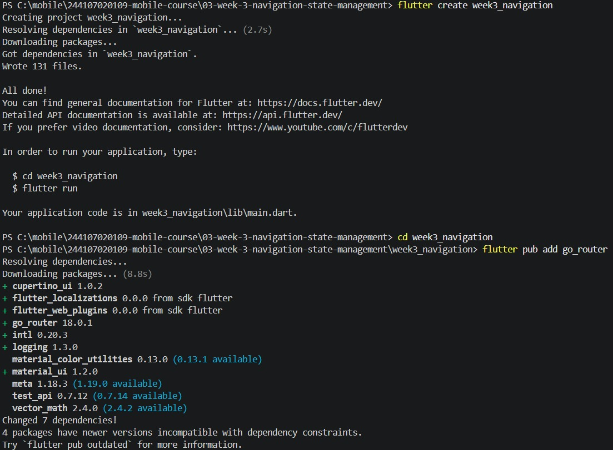

Susunan struktur folder
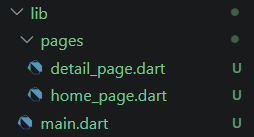

Tampilan 
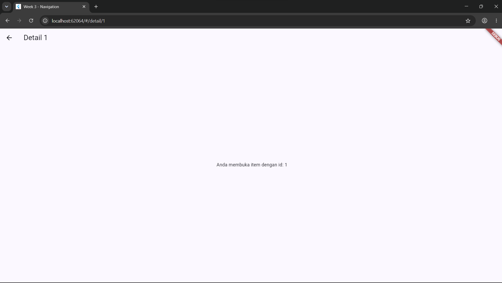
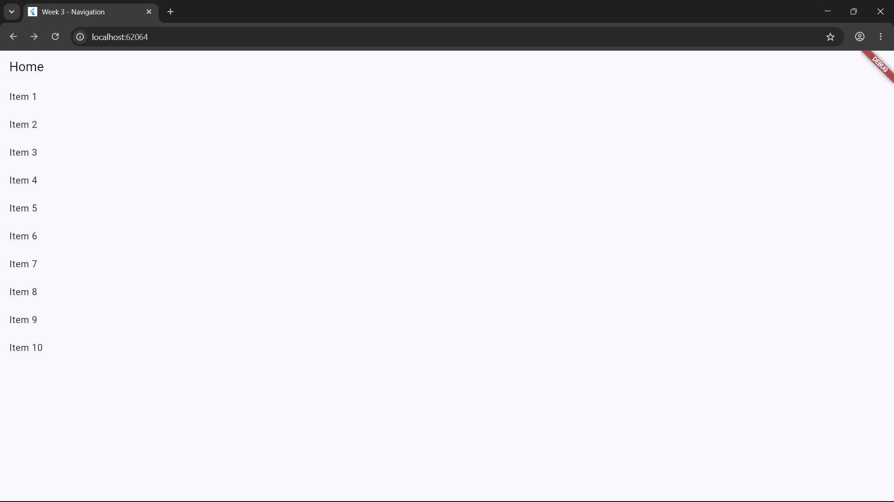

### Praktikum 2 - Aplikasi ToDo dengan Riverpod
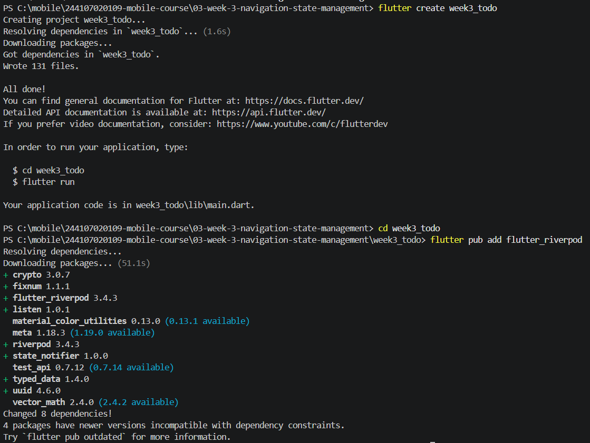

Tampilan 
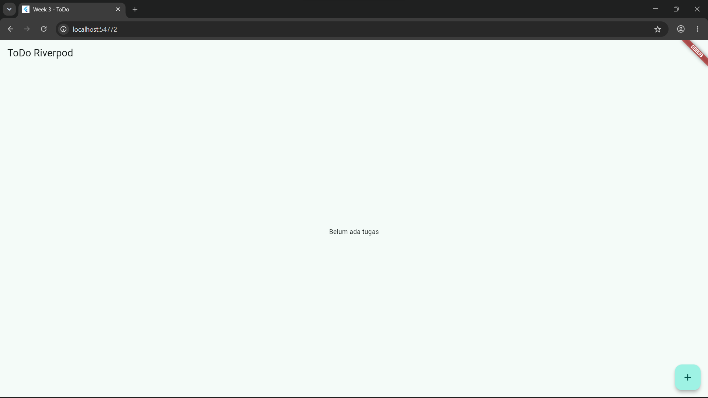

### Praktikum 3 
1. Salin kode di atas ke project ToDo Anda (atau project terpisah) dan jalankan. Amati tampilan loading selama 2 detik pertama.
- Tampilan saat loading
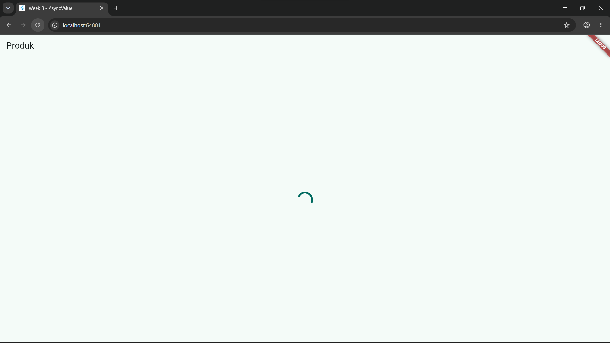
- Tampilan product page
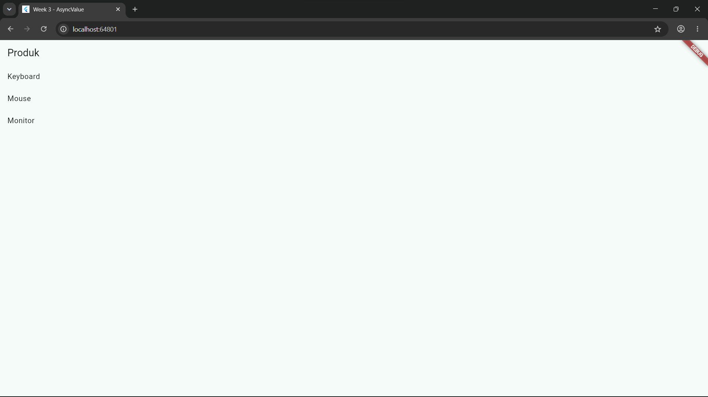
2. Ubah build() sementara untuk melempar error: throw Exception('Gagal terhubung ke server');. Jalankan dan amati UI error beserta tombol Coba lagi.
- Tampilan error
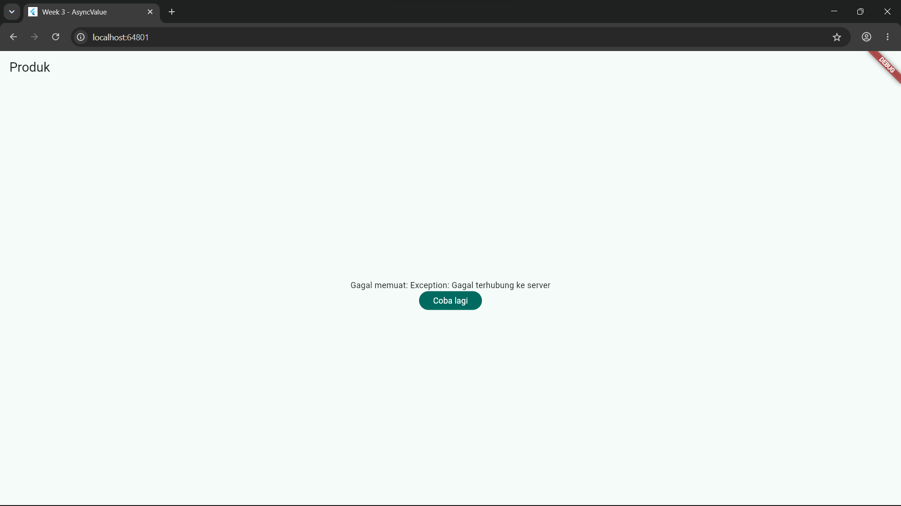
3. Tekan tombol Coba lagi, ref.invalidate membuat provider dijalankan ulang. Pulihkan kode, pastikan state success tampil.
- Tampilan setelah kode dipulihkan 

4. Refleksikan: mengapa menampilkan ulang data lama (stale data) dengan indikator refresh kadang lebih baik daripada mengosongkan layar? Kapan pola itu penting?
- Menampilkan data lama dengan refresh menjaga agar tetap terasa cepat dan tidak membingungkan, karena pengguna masih dapat melihat informasi terakhir ketika menunggu data baru diunduh di latar belakang. Lalu pola ini penting saat pengguna melakukan refresh pada halaman, melihat riwayat transaksi dan menggunakan aplikasi di tempat yang susah sinyal.

### AI Challenge
Minta AI coding assistant (Cursor, Copilot, Claude Code, atau tool setara) dengan prompt berikut:

Buatkan halaman Flutter bernama StatsPage menggunakan flutter_riverpod.
Requirements:
- ConsumerWidget dengan satu AsyncNotifierProvider yang mensimulasikan
  pengambilan data statistik (delay 2 detik, kadang gagal 30%).
- UI harus menangani loading (spinner), error (pesan + tombol retry),
  dan success (ListView 3 item).
- Berikan unit test untuk notifier-nya.
Jelaskan setiap bagian kode dalam komentar.

### AI Verification Checklist
1. Apakah state diubah secara immutable (tidak ada state.add() atau mutasi list langsung)?
- State sudah diubah menggunakan imutable. Di dalam StatsNotifier, state merupakan `AsyncValue<List<StatItem>>`. Pembaruan state dilakukan dengan memberikan/menetapkan instance baru secara langsung `(state = const AsyncLoading();` dan `state = await AsyncValue.guard(...))`, bukan dengan mengubah atau memutasi objek list lama secara langsung.
2. Apakah ref.watch hanya dipakai di dalam build, dan ref.read di callback?
- `ref.watch` Hanya dipanggil di dalam metode `build()` milik `StatsPage (final statsAsync = ref.watch(statsProvider);)` untuk mendengarkan perubahan state dan merender ulang UI.
- `ref.read` Hanya dipanggil di dalam event/callback tombol (onPressed) untuk memicu aksi tanpa memicu rebuild berlebih `(ref.read(statsProvider.notifier).refresh())`.
3. Apakah ketiga state AsyncValue benar-benar ditangani (bukan hanya success)?
- Ya, ketiga state ditangani secara penuh.
Menggunakan metode `.when()` dari `AsyncValue `yang menangani 3 kondisi secara eksplisit: `Loading` dimana menampilkan indikator pemutaran (loading spinner) dan teks petunjuk, `Error` saat menampilkan ikon, pesan kesalahan, dan tombol "Coba Lagi" untuk melakukan retry dan juga `Data` (success) yang menampilkan daftar 3 item statistik menggunakan `ListView.builder`.
4. Apakah provider dideklarasikan dengan tipe eksplisit dan tidak duplikat dengan provider lain?
- Provider dideklarasikan dengan tipe generik yang jelas, dengan tipe notifier `(StatsNotifier)` dan tipe datanya `(List<StatItem>)` tertulis eksplisit serta memiliki nama variabel unik yang tidak berbenturan dengan provider lain.
5. Apakah kode AI memakai API Riverpod versi lama (StateProvider antipattern, StateNotifierProvider usang, atau Consumer bertingkat yang tidak perlu)? Perbaiki ke pola Notifier/ConsumerWidget.
- Kode sudah menggunakan API modern Riverpod. Menggunakan AsyncNotifier dan AsyncNotifierProvider (bukan StateNotifier / StateNotifierProvider). Halaman UI menggunakan `ConsumerWidget` langsung, dan bebas dari penggunaan StateProvider.
6. Jalankan flutter analyze dan flutter test, apakah hasil AI lolos tanpa warning?
- Flutter analyze berhasil
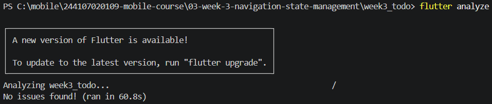
- Flutter test terdapat 2 error, error yang pertama pada `widget_test.dart` dikarenakan file `widget_test.dart` adalah bawaan template proyek awal yang menguji aplikasi counter default. Karena aplikasi sudah diubah menggunakan Riverpod, widget test bawaan gagal membaca ProviderScope dan angka 0, solusinya dengan mengganti isi dari file widget_test agar lebih sesuai. Error yang kedua pada `stats_notifier_test.dart` dikarenakan di dalam method `_fetchStats(),` terdapat `await Future.delayed(const Duration(seconds: 2));`. Saat menguji future error, `container.dispose()` dipanggil terlalu cepat di `addTearDown` sementara delay 2 detik belum selesai, sehingga Riverpod melempar `StateError` karena container di-dispose saat masih loading, dan perbaikan yang dilakukan dengan memanggil `container.dispose()` secara manual pada baris paling akhir dan juga menangkap exception secara eksplisit menggunakan blok try-catch, lalu memeriksa hasilnya dengan `expect(caughtError, isA<Exception>())`.
- output awal 
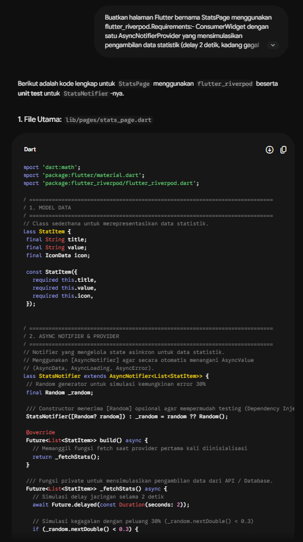
- Hasil testing
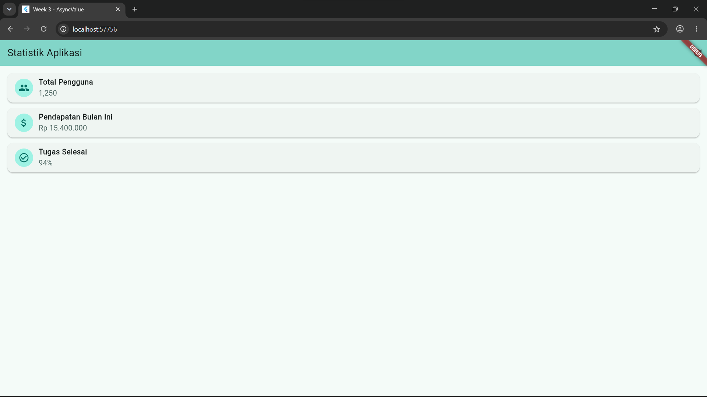

### Refactoring Challeng
1. Komponen baris tugas pada daftar ToDo dipisahkan dari TodoPage menjadi widget tersendiri bernama TodoTile.
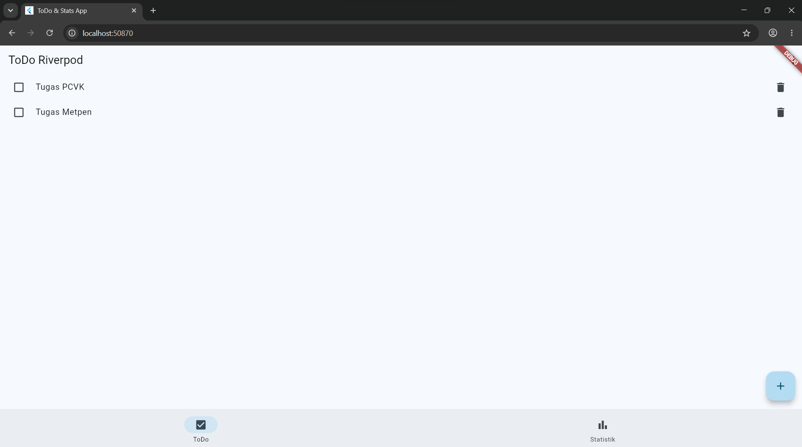
Setiap baris tugas (terdiri dari Checkbox, judul tugas, dan IconButton hapus) berhasil ditampilkan menggunakan komponen TodoTile. Fungsi centang dan hapus berjalan lancar dengan memicu aksi pada todoListProvider.
2. 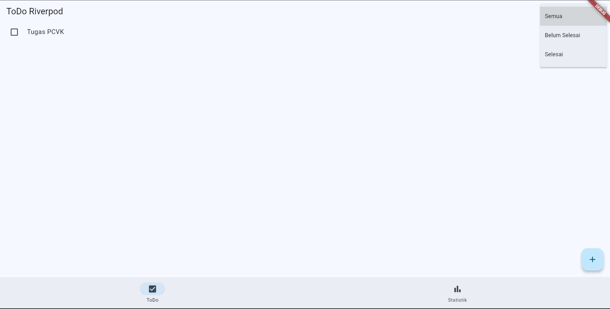
3. Penambahan NavigatorBar untuk memudahkan berpindah
- path URL halaman todo 
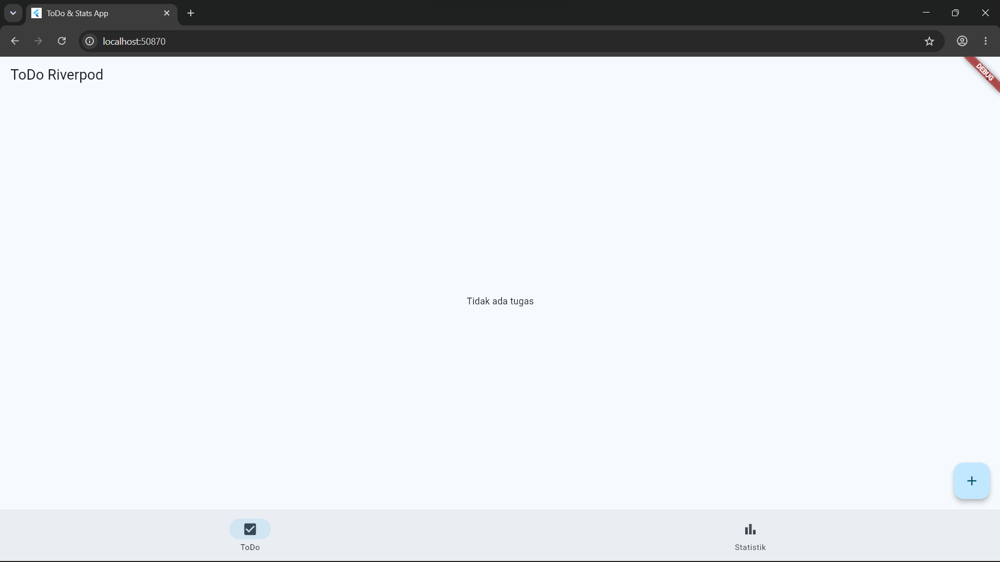
- path URL halaman statistik
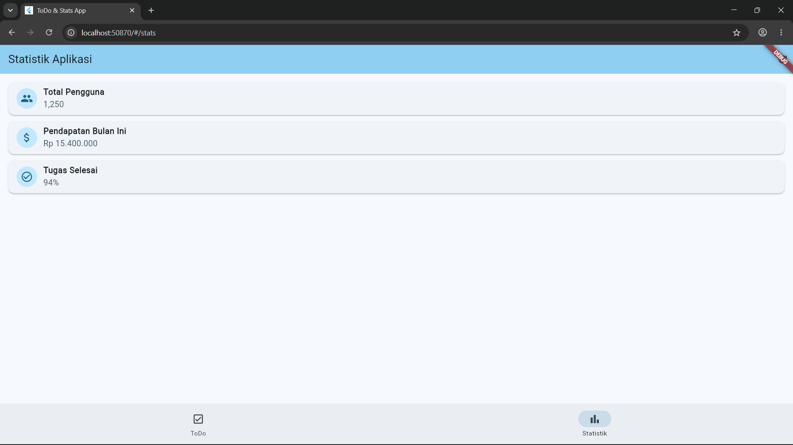

### Checklist verifikasi mandiri
1. Navigasi GoRouter bekerja: pindah halaman, back, dan akses path detail langsung.
- path URL halaman todo 

- path URL halaman statistik

2. ProviderScope membungkus root aplikasi; state ToDo bertahan saat berpindah halaman.
- saat berpindah ke halaman statistik, tugas yang telah ditambahkan ke todo tetap ada, tidak hilang

3. UI AsyncValue menangani loading, error, dan success, bukan hanya success.
- loading
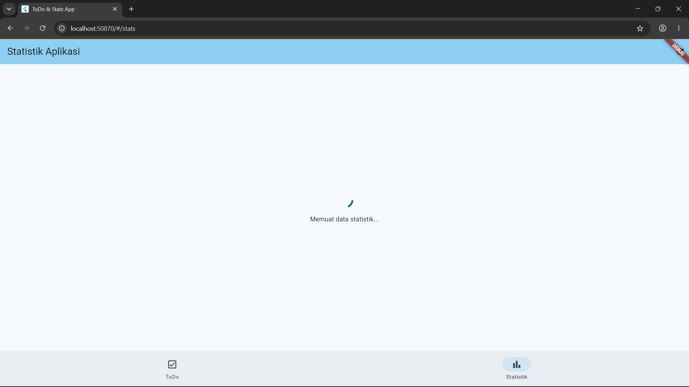
- error
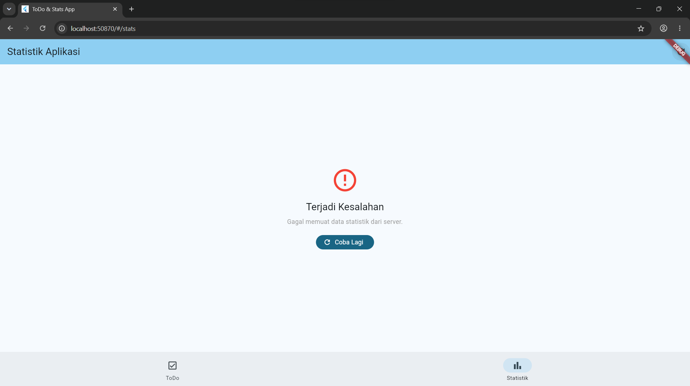
- success

4. flutter analyze tanpa issue dan semua test lulus.

### Refleksi
1. Kapan setState masih cukup, dan kapan state harus naik ke Riverpod?
- dapat menggunakan `setState` ketika state bersifat lokal atau hanya dibutuhkan oleh satu widget itu sendiri, dan state harus naik ke Riverpod ketika state bersifat global/shared yang perlu dibagikan atau dibaca oleh beberapa widget/halaman yang berbeda.
2. Apa perbedaan context.go dan context.push, dan kapan masing-masing tepat digunakan?
- context.go 
  - navigasi berdasarkan path URL
  - penyusunan stack tidak selalu menumpuk rute baru
  - cocok untuk navigasi utama seperti berpindah tab via NavigatorBar
- context.push
  - menambahkan halaman baru di atas stack halaman yang ada
  - menumpuk halaman baru secara eksplisit di atas halaman saat ini
  - cocok untuk alur sementara yang membutuhkan tombol back kembali ke layar sebelumnya.
3. Bagaimana AsyncValue mencegah bug dibanding tiga boolean terpisah?
- menggunakan tiga boolean terpisah rawan menimbulkan bug karena berpotensi menciptakan state yang tidak valid, async mencegah bug dengan cara mengisolasi status data menjadi bentuk sealed class/discriminal union yang memiliki 3 status mutlak (data, error dan loading).
4. Bagian mana dari hasil AI yang Anda perbaiki, dan mengapa?
- Penanganan Waktu Asinkron pada Unit Test (stats_notifier_test.dart)perbaikan yang dilakukan dengan menambahkan library fake_async dan menggunakan async.elapse() alih-alih membiarkan penundaan waktu riil (Future.delayed). Dikarenakan AI di awal tidak memperhitungkan bahwa eksekusi Future.delayed(Duration(seconds: 2)) pada unit test menyebabkan timeout error (30 detik). Dengan fake_async, waktu diuji secara deterministik dan instan.
- Pengkodean Target Finder pada Widget Test (widget_test.dart) perbaikan yang dilakukan dengan mengubah pencarian teks dari 'Belum ada tugas' menjadi 'Tidak ada tugas', serta mengganti pencarian find.byType(PopupMenuButton) menjadi find.byIcon(Icons.more_vert). alasan karena AI menghasilkan kode tes berbasis template umum. Perbaikan dilakukan agar finder sesuai dengan konstanta string UI aktual dan menangani tipe generik `PopupMenuButton<TodoFilter>` yang tidak bisa ditangkap oleh type finder biasa.