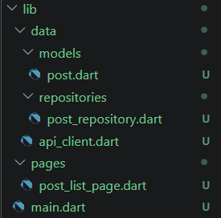

|  | Pemrograman Mobile |
|--|--|
| NIM |  244107020109|
| Nama |  Aisya Aswy Nur Aidha |
| Kelas | TI - 3H |

# WEEK 4
## Networking & REST API

### Praktikum 1 - Dio dan model data
Siapkan project

Susunan struktur folder

Membuat file post.dart sebagai model data untuk memetaka  JSON dari API menjadi objek Dart, api_client.dart sebagai konfigurasi HTTP client terpusat menggunakan Dio, dan post_repository.dart sebagai pintu masuk dan pengelola data (memanggil Dio untuk mengambil data endpoint /posts dan mengubah daftar JSON menjadi daftar list).

### Praktikum 2 - Provider dan error handling

Membuat file providers.dart sebagai pengubah exception teknis menjadi pesan yang dapat ditampilkan ke pengguna, dan file post_list_page.dart untuk memberikan tampilan pada setiap state, dan mengisi file main.dart.

#### Uji tiga skenario error
1. Jalankan aplikasi dengan internet normal, amati loading lalu daftar 100 posts.

2. Matikan internet (mode pesawat), tekan refresh, amati pesan ramah + tombol Coba lagi. Nyalakan kembali internet, tekan Coba lagi.
- tampilan ketika internet dimatikan

- ketika di refresh dan internet nyala kembali

3. Sementara ubah baseUrl menjadi URL salah, amati pesan error koneksi. Kembalikan setelah uji.

