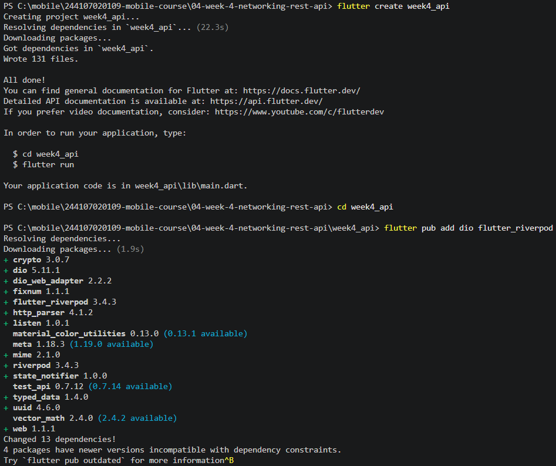
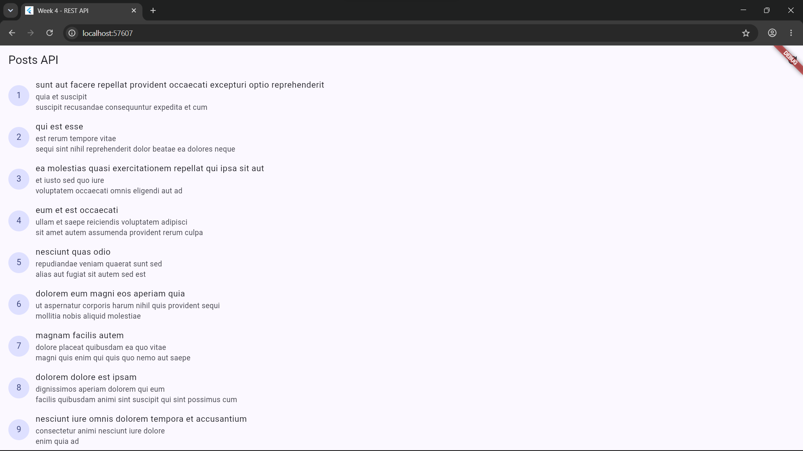
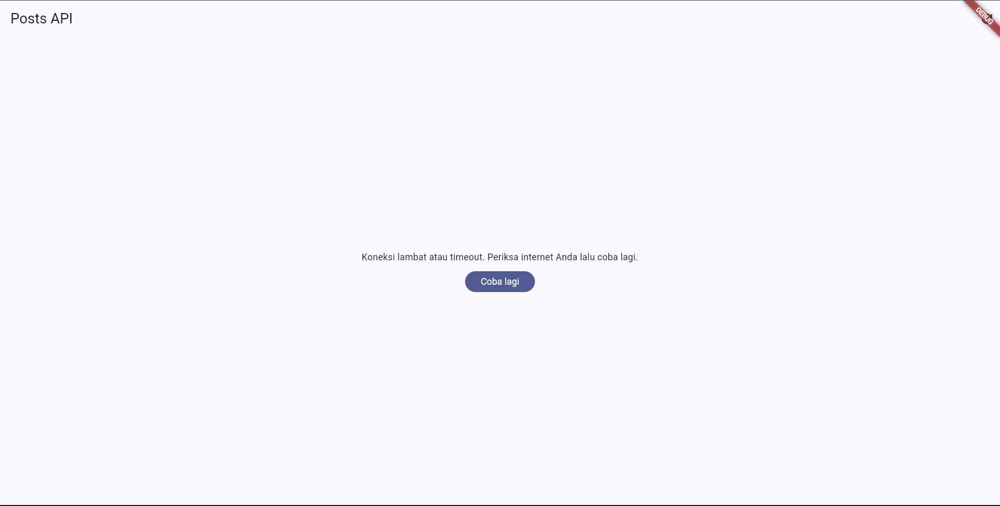
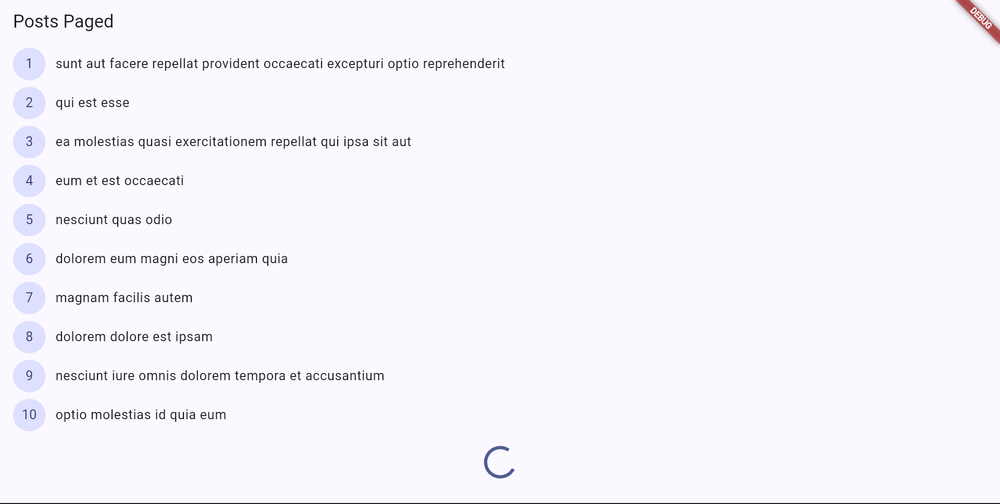
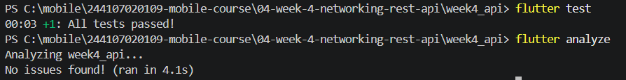

|  | Pemrograman Mobile |
|--|--|
| NIM |  244107020109|
| Nama |  Aisya Aswy Nur Aidha |
| Kelas | TI - 3H |

# WEEK 4
## Networking & REST API

### Praktikum 1 - Dio dan model data
Siapkan project


Susunan struktur folder


Membuat file post.dart sebagai model data untuk memetaka  JSON dari API menjadi objek Dart, api_client.dart sebagai konfigurasi HTTP client terpusat menggunakan Dio, dan post_repository.dart sebagai pintu masuk dan pengelola data (memanggil Dio untuk mengambil data endpoint /posts dan mengubah daftar JSON menjadi daftar list).

### Praktikum 2 - Provider dan error handling

Membuat file providers.dart sebagai pengubah exception teknis menjadi pesan yang dapat ditampilkan ke pengguna, dan file post_list_page.dart untuk memberikan tampilan pada setiap state, dan mengisi file main.dart.

#### Uji tiga skenario error
1. Jalankan aplikasi dengan internet normal, amati loading lalu daftar 100 posts.

2. Matikan internet (mode pesawat), tekan refresh, amati pesan ramah + tombol Coba lagi. Nyalakan kembali internet, tekan Coba lagi.
- tampilan ketika internet dimatikan

- ketika di refresh dan internet nyala kembali

3. Sementara ubah baseUrl menjadi URL salah, amati pesan error koneksi. Kembalikan setelah uji.


### Praktikum 3 - Pagination dasar
Menambahkan method ke PostRepository dan membuat file paged_post.dart dengan notifier dan membuat paged_post_page.dart dengan ScrollController yang memicu halaman berikut 2--px sebelum ujung list.

- tampilan setelah merubah main.dart menjadi PagedPostPage

halaman akan menampilkan 10 data dan muncul indikator dan data akan bertambah saat di scroll tanpa reload penuh.

### AI Challenge

Minta AI coding assistant (Cursor, Copilot, Claude Code, atau tool setara) dengan prompt berikut:

>Buatkan repository layer Flutter untuk endpoint GET /comments?postId={id}
dari JSONPlaceholder menggunakan Dio + flutter_riverpod.
Requirements:
>- Model Comment dengan fromJson aman null (postId, id, name, email, body).
>- CommentRepository dengan method fetchComments(postId) + timeout 10 detik.
>- AsyncNotifierProvider dengan penanganan error otomatis (AsyncError) dan fungsi pesan error ramah pengguna untuk timeout, connection error, 404, dan 500.
>- Satu unit test untuk fromJson dengan field yang hilang.
>Jelaskan setiap bagian kode dalam komentar.

### AI Verification Checklist
Sebelum kode AI diterima, verifikasi hal berikut dan catat temuan Anda di README:

1. Apakah UI memanggil Dio secara langsung (dilarang) atau lewat repository?
- UI memanggil commentsProvider atau postListProvider, yang kemudian mengambil data dari CommentRepository / PostRepository. Objek Dio dikelola di repository layer dan tidak dipanggil langsung oleh widget UI.
2. Apakah fromJson aman null, atau masih memakai cast langsung yang bisa crash?
- Aman null, method fromJson menggunakan defensive casting dengan nilai bawaan (seperti json['name'] as String? ?? '' dan json['postId'] as int? ?? 0), bukan casting langsung (as String) yang bisa memicu type error atau crash.
3. Apakah semua tipe DioExceptionType (timeout, connectionError, badResponse) dipetakan ke pesan pengguna?
- Ya, dipetakan. Fungsi friendlyErrorMessage menangani connectionTimeout, sendTimeout, receiveTimeout, connectionError, serta badResponse (status code 404 dan 500) dengan pesan bahasa Indonesia yang ramah pengguna.
4. Apakah baseUrl/timeout terpusat di satu client, bukan tersebar di tiap method?
- Ya, terpusat. Pengaturan baseUrl dan timeout dikonfigurasi secara global di lib/data/api_client.dart melalui fungsi createDio() dan dimanfaatkan oleh dioProvider.
5.  Apakah test AI benar-benar menguji kasus field hilang, atau hanya happy path? Tambahkan minimal 1 edge case sendiri.
- Ya, menguji kasus field hilang. Unit test pada test/comment_test.dart menguji parser Comment.fromJson ketika menerima map JSON yang tidak lengkap.
Edge Case Tambahan (Mismatched Data Types):
```
test('fromJson aman saat menerima tipe data yang salah (mismatched type)', () {
  final Map<String, dynamic> wrongTypeJson = {
    'postId': 'bukan_integer',
    'id': null,
    'name': 12345,
    'email': true,
    'body': null,
  };

  final comment = Comment.fromJson(wrongTypeJson);

  expect(comment.postId, equals(0));
  expect(comment.id, equals(0));
  expect(comment.name, equals(''));
  expect(comment.email, equals(''));
  expect(comment.body, equals(''));
});
```
6. Jalankan flutter analyze dan flutter test, apakah hasil AI lolos tanpa warning?


- Bagian yang dilakukan perbaikan
1. Provider dan Error Handling (lib/data/comment_provider.dart)
    - Sintaks Class CommentNotifier:
    AI awal sering menghasilkan sintaks generator yang keliru atau turunan class yang tidak tepat, menyebabkan error "classes can only extend other classes". Perbaikannya adalah mengubah deklarasi class menjadi "extends FamilyAsyncNotifier<List, int>" dengan method "build(int arg)".
    - Inisialisasi Provider: 
    Menggunakan "AsyncNotifierProvider.family<CommentNotifier, List, int>" agar kompatibel secara manual tanpa perlu menjalankan perintah code generation (build_runner).
    - Penggunaan Dio Terpusat:
    Mengaitkan instansiasi CommentRepository dengan fungsi createDio() dari api_client.dart agar konfigurasi baseUrl dan timeout tetap terpusat.
    - Pesan Error Ramah Pengguna (friendlyErrorMessage):
    Menambahkan penanganan khusus untuk status badResponse HTTP 404 dan 500, serta variasi timeout dan connectionError dengan teks bahasa Indonesia yang jelas.

2. Testing (test/widget_test.dart)
    - Pengisolasian Request Jaringan (Mocking): Menjalankan flutter test pada UI yang memanggil API asli akan menghasilkan error "A Timer is still pending even after the widget tree was disposed". Perbaikannya adalah membuat FakePagedPostsNotifier untuk meng-override pagedPostsProvider di lingkungan pengujian, sehingga request HTTP tidak pernah dieksekusi saat tes berjalan.
    - Penguatan Parser Model (Comment.fromJson): Menambahkan pengujian edge case untuk menguji kondisi saat API mengirimkan tipe data yang salah (mismatched type), misalnya saat ID dikirim sebagai String atau nama sebagai integer.

3. Model Comment (lib/data/models/comment.dart)
    - Defensive Casting: 
    Menggunakan casting aman dengan fallback nilai bawaan (misalnya "as String? ?? ''" dan "as int? ?? 0") pada method fromJson untuk mencegah aplikasi crash akibat null value.

