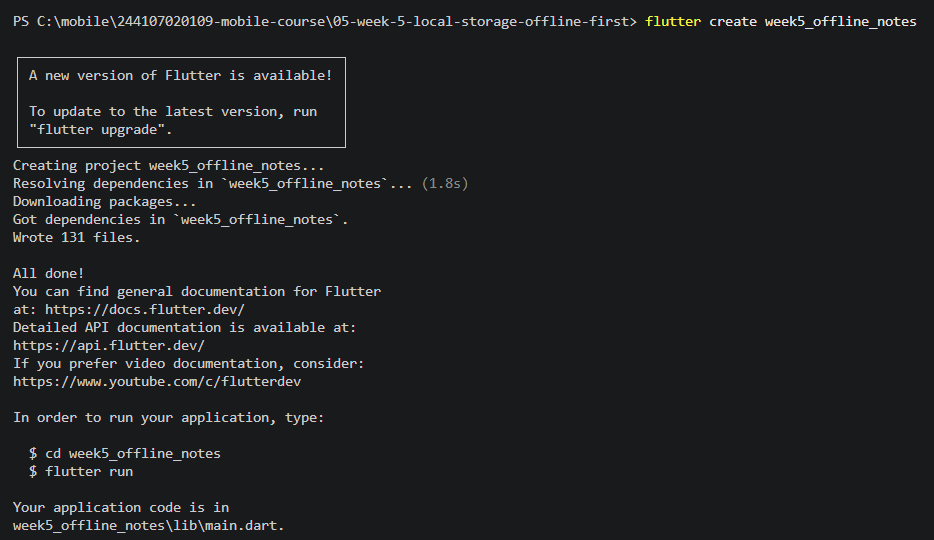
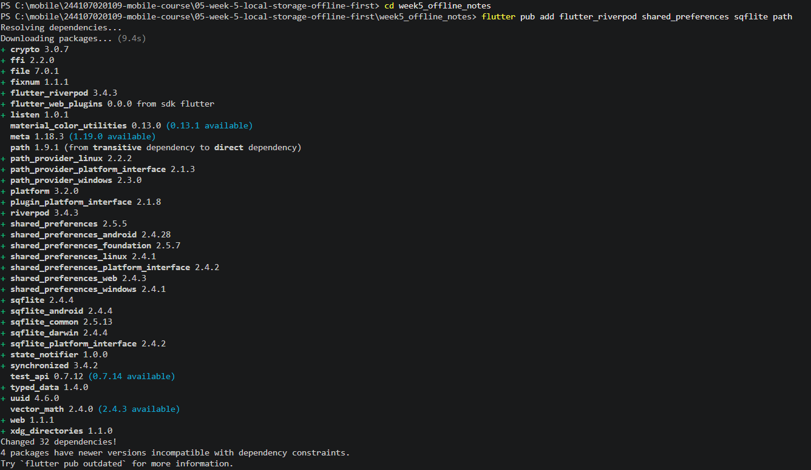
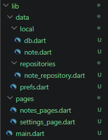
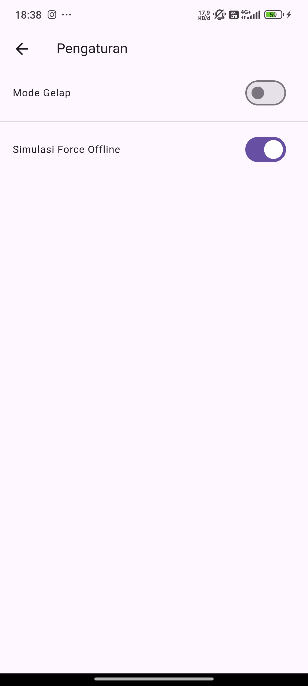
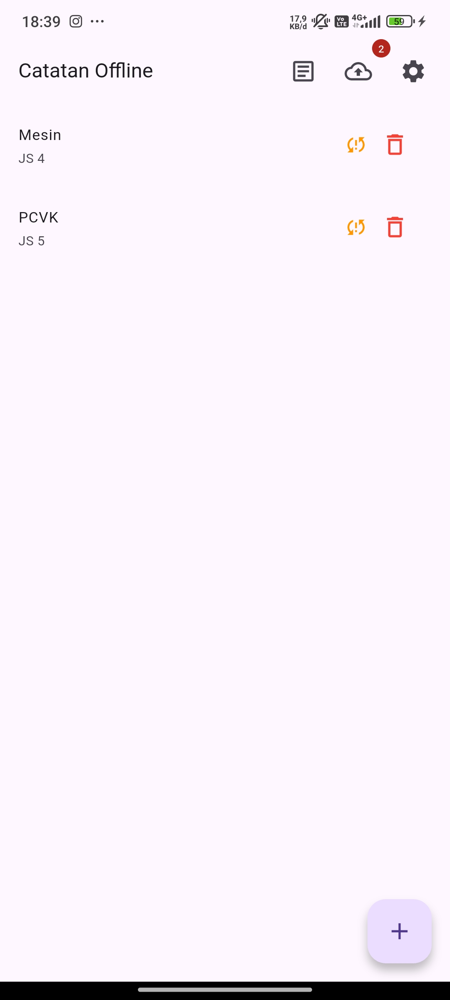
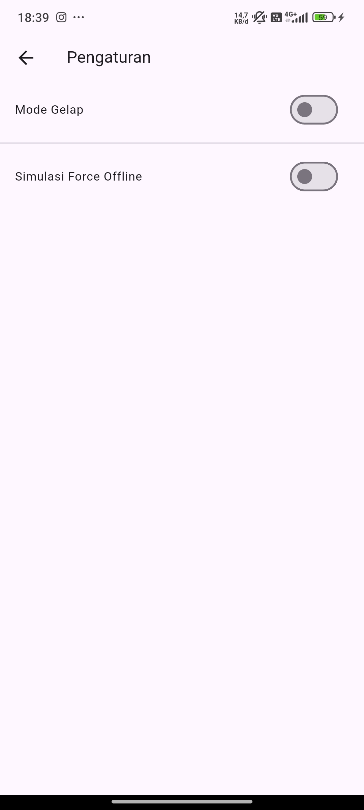
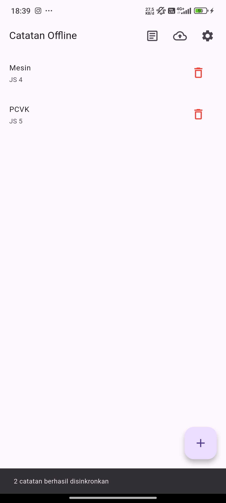

|  | Pemrograman Mobile |
|--|--|
| NIM |  244107020109|
| Nama |  Aisya Aswy Nur Aidha |
| Kelas | TI - 3H |

# **WEEK 5 - Local Storage & Offline First**

## **Praktikum 1 - SharedPreferences**

Persiapan project



Struktur folder



Membuat file prefs.dart dan settings_page.dart.

## **Praktikum 2 - SQLite dan repository catatan**

Membuat file note.dart dan file db.page.dart

## **Praktikum 3 - Cache-first dan antrean sync**

Berdasarkan hasil pengujian yang telah dilakukan, mekanisme Cache-First pada aplikasi berhasil dijalankan dengan baik. Aplikasi mampu menampilkan data postingan secara instan dari penyimpanan lokal SQLite cached_posts saat pertama kali dibuka maupun dalam kondisi tanpa koneksi internet. Proses fetching data dari API JSONPlaceholder melalui Dio yang berjalan di background juga secara otomatis memperbarui cache lokal tanpa mengganggu responsivitas antarmuka pengguna (UI).

### Simulasi Offline yang Deterministik & Sinkronisasi Data

Untuk mempermudah pengujian tanpa bergantung pada kondisi koneksi internet atau Wi-Fi, aplikasi menyediakan dua mekanisme pengujian offline: menggunakan mode pesawat sungguhan dan sakelar *Simulasi Force Offline* pada provider.

---

#### 1. Langkah-Langkah Pengujian

1. **Pengujian Kondisi Offline (Force Offline / Mode Pesawat):**
   * Aktifkan sakelar *Simulasi Force Offline* melalui Halaman Pengaturan (atau matikan Wi-Fi / aktifkan Mode Pesawat pada perangkat).
   * Buka kembali Halaman Utama Catatan.
   * Tambahkan beberapa catatan baru.
   * **Observasi:** Catatan baru berhasil tersimpan ke SQLite lokal, catatan tetap tampil di daftar, dan indikator *badge* pada ikon awan secara akurat menunjukkan jumlah catatan *dirty* (misalnya angka **2**).

2. **Pengujian Sinkronisasi Data (`syncNotes`):**
   * Nonaktifkan sakelar *Simulasi Force Offline* di Pengaturan (atau nyalakan kembali koneksi Wi-Fi/data).
   * Tekan tombol ikon awan di `AppBar` untuk menjalankan proses sinkronisasi (`syncNotes`).
   * **Observasi:** Aplikasi memperbarui status `dirty` dari `2` menjadi `0` pada database SQLite. Indikator *badge* angka pada ikon awan otomatis hilang, dan SnackBar konfirmasi sinkronisasi muncul di layar.

---

#### 2. Hasil Observasi Sinkronisasi

| Parameter | Sebelum Sinkronisasi (Offline) | Sesudah Sinkronisasi (Online + `syncNotes`) |
| :--- | :--- | :--- |
| **Status Koneksi** | Force Offline / Mode Pesawat Aktif | Online / Force Offline Mati |
| **Nilai `dirty` SQLite** | `2` (Catatan Kotor) | `0` (Tersinkronisasi) |
| **Jumlah Badge Awan** | Menampilkan angka sesuai jumlah catatan baru (misal: **2**) | **0** (Badge Otomatis Hilang) |
| **Pesan Antarmuka** | Indikator `sync_problem` warna oranye pada item | SnackBar konfirmasi berhasil sinkron |

---

#### 3. Lampiran Screenshot Pengujian

Seluruh gambar hasil pengujian telah disimpan ke dalam folder `screenshots/`:

### Tabel Lampiran Bukti Pengujian Sync & Force Offline

| No | File Screenshot | Kondisi & Fitur | Keterangan Observasi |
| :---: | :--- | :--- | :--- |
| 1 |  | **Force Offline Aktif** | Sakelar *Simulasi Force Offline* diaktifkan pada Halaman Pengaturan untuk memutus koneksi API. |
| 2 |  | **Catatan Kotor (Dirty)** | Penambahan 2 catatan baru saat offline. Terdapat indikator oranye pada item dan *badge* angka **2** pada ikon awan (`dirty = 2`). |
| 3 |  | **Force Offline Mati** | Sakelar *Simulasi Force Offline* dimatikan kembali untuk mensimulasikan koneksi internet yang terhubung. |
| 4 |  | **Hasil Sinkronisasi** | Setelah tombol awan ditekan, timbul SnackBar *"2 catatan berhasil disinkronkan"*, indikator oranye hilang, dan *badge* kembali ke **0** (`dirty = 0`). |

### Aturan Konflik

Aplikasi ini menerapkan kebijakan Last-Write-Wins (LWW) berbasis stempel waktu updated_at untuk menangani konflik data saat proses sinkronisasi dua arah. Tanpa aturan ini, data lokal dan data server berisiko saling menimpa secara diam-diam (silent overwriting) yang dapat menghilangkan perubahan terbaru. Setiap kali catatan dibuat atau diubah, kolom updated_at pada tabel SQLite otomatis menyimpan stempel waktu terkini dalam format ISO-8601 melalui model Note. Saat sinkronisasi dilakukan, sistem akan membandingkan stempel waktu antara data lokal dan server untuk ID catatan yang sama, lalu mempertahankan versi data dengan stempel waktu paling baru.

## **AI Challenge: Perbandingan dan Justifikasi Pemilihan Storage**
Peran AI pada bagian ini adalah memberikan opsi dan analisis teknis. Keputusan akhir dan justifikasi pemilihan teknologi sepenuhnya ditentukan oleh pengembang.

---

#### 1. Tabel Perbandingan Opsi Storage

| Kriteria | SharedPreferences | Hive | sqflite (SQLite) | Drift |
| :--- | :--- | :--- | :--- | :--- |
| **Kompleksitas Query** | Sangat Rendah (Key-Value) | Rendah (Filter Objek Manually) | Tinggi (SQL Native) | Sangat Tinggi (Type-safe SQL/Dart) |
| **Kebutuhan Relasi** | Tidak Ada | Terbatas (Manual Linking) | Ya (Foreign Key, Join) | Ya (Relasi Terstruktur & Type-safe) |
| **Reaktivitas (Stream)** | Tidak Ada (Manual Polling) | Ya (`Watchable`) | Tidak Ada (Perlu Riverpod/StreamController) | Ya (Native Stream/Reactive Queries) |
| **Type-Safety** | Sangat Rendah (Dynamic) | Sedang (Perlu TypeAdapter) | Rendah (Manual Map Mapping) | Sangat Tinggi (Code Generation) |
| **Ukuran Boilerplate** | Sangat Kecil | Sedang | Sedang ke Tinggi | Tinggi (Perlu Code Gen / `build_runner`) |
| **Kemudahan Testing** | Sangat Mudah (Mocking) | Mudah | Sedang (Perlu SQLite Binary) | Sangat Mudah (In-memory Database) |

---

#### 2. Trade-Off Masing-Masing Pilihan

* **SharedPreferences:**
  * *Kelebihan:* Sangat ringan, mudah digunakan, tanpa *boilerplate*.
  * *Kekurangan:* Tidak dirancang untuk data terstruktur, tidak mendukung kueri kompleks atau pencarian, dan seluruh data dimuat ke memori.
* **Hive:**
  * *Kelebihan:* Performa *read/write* sangat cepat, *schemaless*, dan mendukung reaktivitas.
  * *Kekurangan:* Pengelolaan relasi antar data cukup rumit dan rawan error jika terjadi perubahan struktur objek (*breaking changes* pada adapter).
* **sqflite (SQLite):**
  * *Kelebihan:* Standar industri untuk relational database, sangat stabil, mendukung kueri SQL kompleks (`WHERE`, `JOIN`, status `dirty`).
  * *Kekurangan:* Banyak *boilerplate code*, penulisan SQL berbasis string (raw string) rawan *typo*, dan tidak ada reaktivitas bawaan.
* **Drift:**
  * *Kelebihan:* Menawarkan seluruh kekuatan SQLite dengan fitur *type-safety*, reaktivitas *stream*, dan kemudahan *testing* via *in-memory database*.
  * *Kekurangan:* Membutuhkan proses *build_runner* (code generation) yang menambah kompleksitas *setup* awal.

---

#### 3. Rekomendasi Final & Justifikasi

| Kebutuhan Aplikasi | Pilihan Storage Terbaik | Alasan & Justifikasi Utama |
| :--- | :--- | :--- |
| **Preferensi Tema (`isDarkMode`)** | **SharedPreferences** | Data bersifat *key-value* sederhana, berukuran sangat kecil, dan membutuhkan pengaksesan cepat saat *startup* tanpa memerlukan kueri database. |
| **Catatan (`CRUD + Sync Status`)** | **sqflite (SQLite)** | Membutuhkan kueri terstruktur untuk memfilter status sinkronisasi (`WHERE dirty = 1`), mendukung pembuatan indeks, serta memastikan konsistensi data lokal jangka panjang. |

---

#### 4. Skema Database & Kinerja untuk 1000+ Catatan

Untuk menangani **1000+ catatan** secara efisien di SQLite, dibuat skema tabel yang mencakup **Indeks (`INDEX`)** pada kolom `dirty` dan `updated_at` guna mempercepat kueri pencarian dan sinkronisasi.

##### A. Visualisasi Skema Kotak (Entity Diagram)

```text
+-----------------------------------------------------------------------+
|                             TABLE: notes                              |
+---------------------+-------------------+-----------------------------+
| Column Name         | Data Type         | Constraints / Attributes    |
+---------------------+-------------------+-----------------------------+
| id                  | INTEGER           | PRIMARY KEY AUTOINCREMENT   |
| title               | TEXT              | NOT NULL                    |
| body                | TEXT              | DEFAULT ''                  |
| updated_at          | TEXT              | NOT NULL (ISO-8601 String)  |
| dirty               | INTEGER           | NOT NULL DEFAULT 1 (0 or 1) |
+---------------------+-------------------+-----------------------------+
| INDEXES:                                                              |
| - idx_notes_dirty   ON notes(dirty)     --> Mempercepat count/sync    |
| - idx_notes_updated ON notes(updated_at)--> Mempercepat sort/LWW      |
+-----------------------------------------------------------------------+
```

##### B. Kode DDL Pembuatan Tabel & Indeks

```sql
-- Tabel Utama
CREATE TABLE notes (
    id INTEGER PRIMARY KEY AUTOINCREMENT,
    title TEXT NOT NULL,
    body TEXT DEFAULT '',
    updated_at TEXT NOT NULL,
    dirty INTEGER NOT NULL DEFAULT 1
);

-- Indeks untuk Optimasi Performance Kueri 1000+ Data
CREATE INDEX idx_notes_dirty ON notes(dirty);
CREATE INDEX idx_notes_updated ON notes(updated_at);
```

### AI Verification Checklist & Temuan Evaluasi

Sebelum merekomendasikan atau memutuskan opsi *storage*, dilakukan verifikasi teknis terhadap usulan awal AI guna memastikan kesesuaian dengan kebutuhan aplikasi.

---

#### 1. Hasil Verifikasi Temuan AI

* **Apakah AI menempatkan daftar catatan di `SharedPreferences`?**
  * **Temuan & Sikap:** Ditolak. `SharedPreferences` tidak cocok untuk menyimpan koleksi daftar catatan. Menyimpan list objek dalam bentuk JSON String pada `SharedPreferences` sangat rapuh, tidak mendukung pencarian/kueri, dan memiliki risiko kegagalan *parsing* yang tinggi saat data bertambah banyak.

* **Apakah skema AI mendukung antrean sync (`dirty` flag / `updated_at`) atau hanya CRUD polos?**
  * **Temuan & Sikap:** Diterima. Skema yang dirancang telah mencakup atribut `dirty` (INTEGER 0/1) untuk antrean sinkronisasi serta `updated_at` (TEXT ISO-8601) untuk menangani aturan konflik *Last-Write-Wins* (LWW), bukan sekadar CRUD dasar.

* **Apakah klaim "real-time" AI didukung stream (`Drift`/`watch`) atau hanya asumsi?**
  * **Temuan & Sikap:** Diverifikasi. Klaim *real-time* pada `Drift` dan `Hive` terbukti didukung oleh *native stream* (`watch()`). Namun pada `sqflite`, fungsi *real-time* tidak tersedia secara *native* dan harus dikombinasikan dengan *state management* seperti Riverpod (`ref.invalidate()`) atau `StreamController`.

* **Apakah estimasi *boilerplate* AI masuk akal setelah mencoba instalasinya?**
  * **Temuan & Sikap:** Masuk akal. Penggunaan `sqflite` membutuhkan *boilerplate* sedang (penulisan fungsi *helper* database & map *converter*). Sementara `Drift` membutuhkan proses konfigurasi awal dan *build_runner* yang cukup memakan waktu di awal, tetapi memudahkan penulisan kode di tahap selanjutnya.

---

#### 2. Keputusan Final & Argumen Justifikasi

* **Preferensi Aplikasi (Tema & Waktu Buka):** Menggunakan **`SharedPreferences`**.
  * **Argumen:** Data berukuran sangat kecil, berstruktur *key-value*, dan perlu dibaca secara instan saat aplikasi pertama kali dijalankan tanpa beban pemuatan database.

* **Penyimpanan Catatan & Cache API:** Menggunakan **`sqflite` (SQLite)**.
  * **Argumen:** Kebutuhan fitur memerlukan kueri terstruktur untuk memfilter status sinkronisasi (`WHERE dirty = 1`), perhitungan jumlah *dirty data*, serta pengurutan stempel waktu. SQLite terbukti stabil, efisien untuk skema lokal, dan tidak memerlukan pustaka *code generation* tambahan.


## **REFACTORING, TESTING dan ERROR UMUM**
### **Refactoring Challenge**

