|  | Pemrograman Mobile |
|--|--|
| NIM |  244107020109|
| Nama |  Aisya Aswy Nur Aidha |
| Kelas | TI - 3H |

# **WEEK 6 - Authentication, Security & FCM**

## **Praktikum 1 - Login + secure storage + token refresh**

Persiapan project
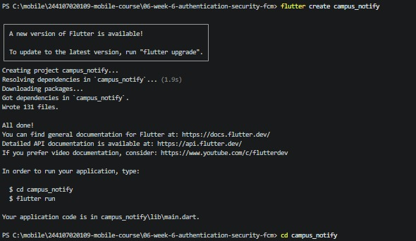
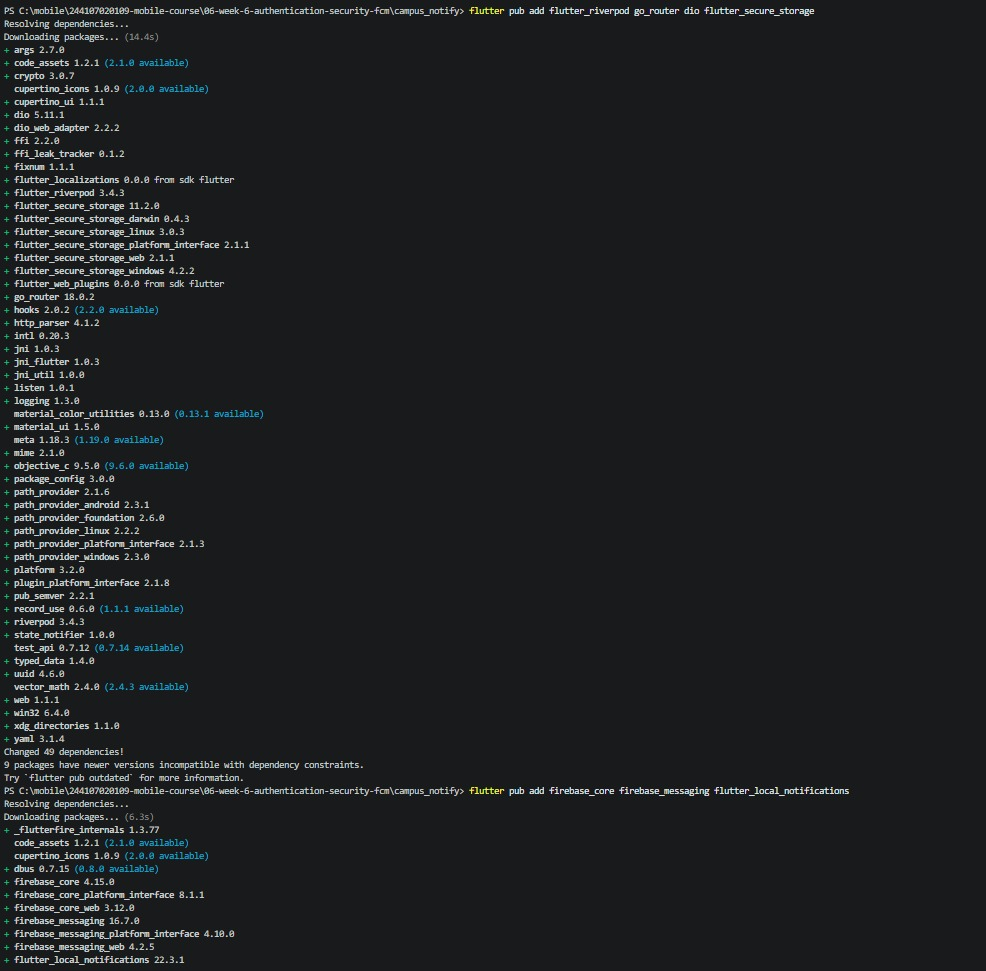

Struktur folder

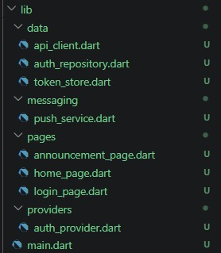

#### **Penyimpanan token yang aman**

Membuat dan mengisi file token_store.dart, auth_repository.dart, api_client.dart, auth_provider.dart dan pengamanan GoRouter di main.dart

**Tampilan pada apps**
|homepage|announcement page|
|---|---|
|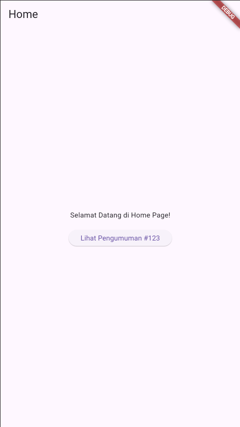|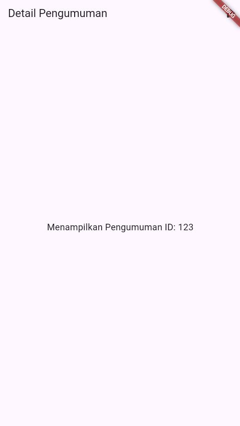|

## **Praktikum 2 - FCM, permission, dan token lifecycle**

#### **1. Daftarkan Aplikasi ke firebase**
1. Buat project di Firebase Console, tambahkan aplikasi Android dengan package name sesuai applicationId Anda.
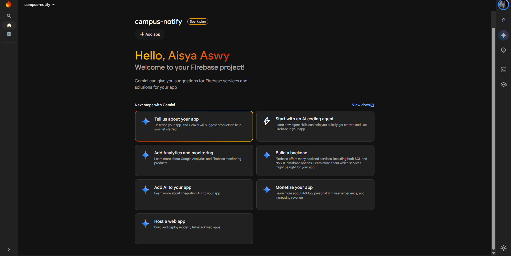
2. Unduh google-services.json ke android/app/ dan ikuti panduan. FCM Flutter client (terapkan plugin google-services dan dependensi). Untuk iOS tambahkan GoogleService-Info.plist.

- modifikasi file [andorid/build.gradle.kts](campus_notify/android/build.gradle.kts)

```kts
plugins {
    id("com.google.gms.google-services") version "4.4.1" apply false
}
```
- modifikasi file [andorid/app/build.gradle.kts](campus_notify/android/app/build.gradle.kts)

```kts
plugins {
    id("com.android.application")
    id("dev.flutter.flutter-gradle-plugin")
    id("com.google.gms.google-services")
}
```
- modifikasi file [pubspec.yaml](campus_notify/pubspec.yaml)

```yaml
dependencies:
  flutter:
    sdk: flutter

  # The following adds the Cupertino Icons font to your application.
  # Use with the CupertinoIcons class for iOS style icons.
  cupertino_icons: ^1.0.8
  flutter_riverpod: ^3.4.3
  go_router: ^18.0.2
  dio: ^5.11.1
  flutter_secure_storage: ^11.2.0
  firebase_core: ^4.15.0
  firebase_messaging: ^16.7.0
  flutter_local_notifications: ^22.3.1
```
3. Pastikan firebase_core diinisialisasi sebelum runApp: await Firebase.initializeApp().
Proses Inisialisasi Firebase dilakukan pada [lib/main.dart](campus_notify/lib/main.dart)
```dart
import 'package:firebase_core/firebase_core.dart';

void main() async {
  WidgetsFlutterBinding.ensureInitialized();
  await Firebase.initializeApp();
  runApp(const ProviderScope(child: MyApp()));
}
```

#### **2. Minta Izin Notifikasi**

Sistem Android 13+ dan iOS mewajibkan aplikasi meminta izin runtime sebelum dapat menampilkan notifikasi. `flutter_local_notifications` digunakan untuk menangani tampilan banner saat notifikasi masuk di foreground dan menyimpan payload deep link ketika banner diklik.

Menambahkan fungsi pada file [push_service.dart](campus_notify/lib/messaging/push_service.dart) dan pemanggilan pada [main.dart](campus_notify/lib/main.dart)

#### **3. Token lifecycle: ambil, kirim ke backend, pantau perubahan**

fungsi `initFcmToken` digunakan untuk mengambil FCM token pertama kali serta mendaftarkan listener onTokenRefresh. Pada tahap ini, pengiriman ke backend diwakili dengan mencetak log/token ke UI/console untuk verifikasi.
 
```dart
        await initFcmToken(
        onToken: (token) async {
        print('FCM Token berhasil didapatkan: $token');
           },
        );
```
Inisialisasi FCM Token dilakukan pada halaman login saat pengguna berhasil melakukan autentikasi. Fungsi initFcmToken mengambil token perangkat dari Firebase Messaging dan mendengarkan perubahan token via onTokenRefresh. Pada tahap ini, pengiriman token ke server backend diwakili dengan log konsol dan penayangan token terpotong (masked) 12 karakter pada halaman utama untuk menjaga keamanan tampilan.

**Wajib dibuktikan**

tampilkan token di halaman Debug (terpotong, mis. 12 karakter pertama + ...), hapus data aplikasi / reinstall, dan tunjukkan bahwa onTokenRefresh memperbarui token di backend. Jangan pernah menampilkan token penuh di screenshot laporan.
|Tampilan Token Terpotong|Reinstall Aplikasi|Token Terbarui|
| :--- | :--- | :--- |
|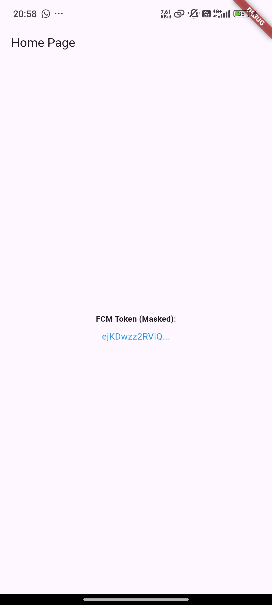|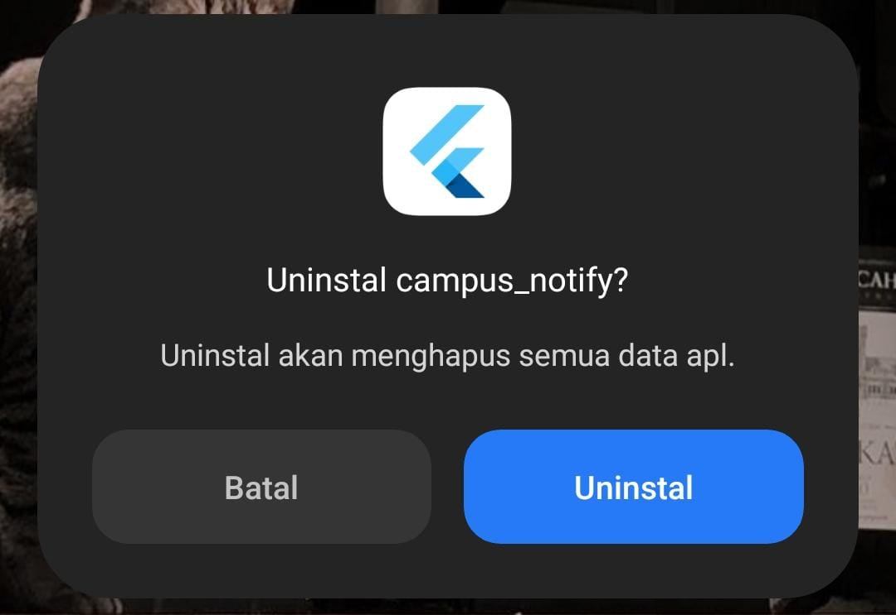|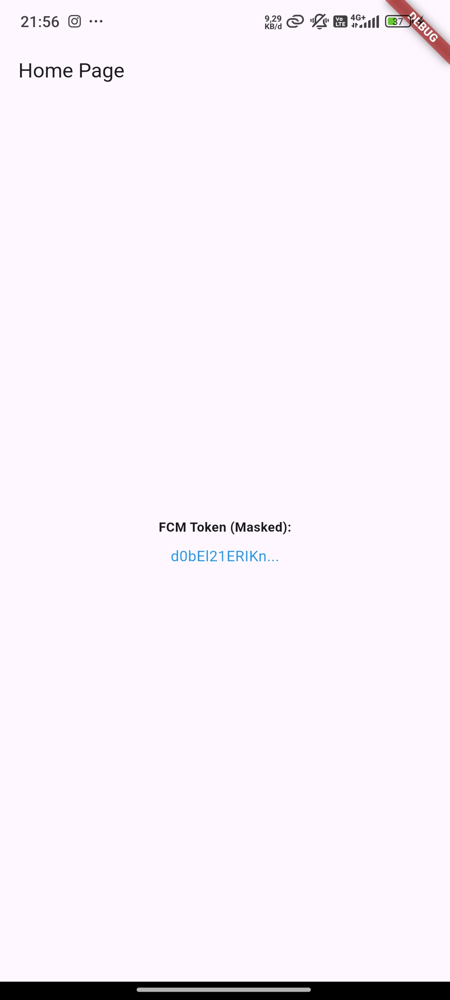|

#### **4. Uji kirim pertama dari Firebase Console**

1. Buka Firebase Console -> Messaging -> buat campaign notifikasi percobaan.
2. Masukkan title dan body, targetkan aplikasi Android Anda.
3. Kirim saat aplikasi dalam state background: banner sistem harus muncul. Klik banner: aplikasi terbuka.
4. Hasilnya bukti screenshots/fcm-console-test.png.
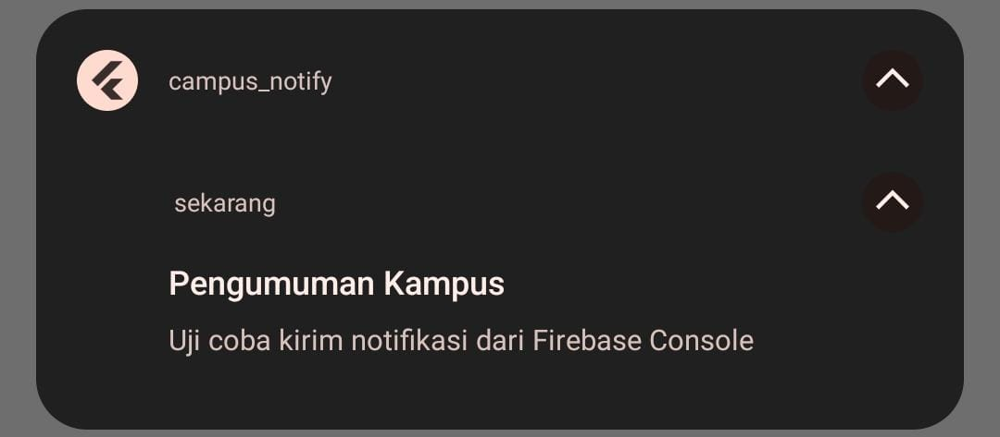


## **Praktikum 3: Payload, tiga app state, klik dan topik**

#### **1. Background handler wajib top-level**
Menambahkan potongan kode pada file `main.dart` 

#### **2. Tiga handler + contoh payload gabungan**
Menambahkan potongan kode pada file `push_service.dart` 

#### **3. Matriks pengujian wajib**
Pengujian dilakukan untuk memverifikasi penanganan pesan notifikasi Firebase Cloud Messaging (FCM) dan navigasi otomatis menggunakan `GoRouter` pada tiga *state* aplikasi yang berbeda.

#### **Matriks Hasil Pengujian**

Pengujian dilakukan untuk memverifikasi penanganan pesan notifikasi Firebase Cloud Messaging (FCM) dan navigasi otomatis menggunakan `GoRouter` pada tiga *state* aplikasi yang berbeda.

| State Aplikasi | Perilaku yang Diharapkan | Bukti Tangkapan Layar | Detail Notifikasi |
| :--- | :--- | :---: | :--- |
| **Foreground** | Banner lokal muncul saat aplikasi terbuka. Ketika diklik, layar berpindah ke `/pengumuman/3`. | 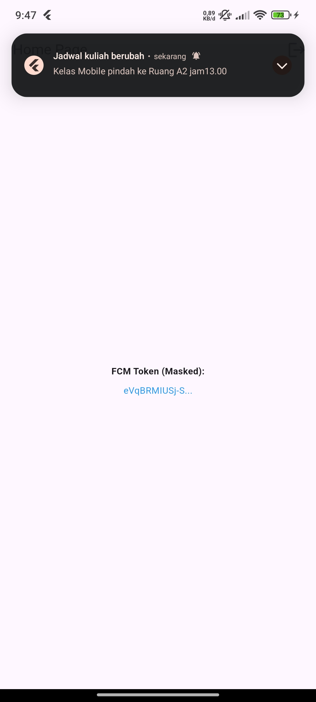 | 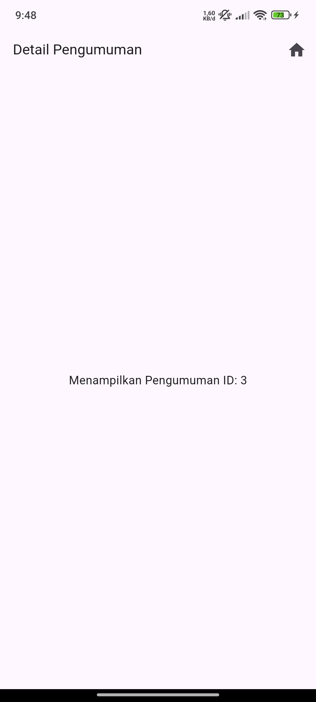 |
| **Background** | Banner sistem muncul saat aplikasi di-*minimize*. Ketika diklik, aplikasi terbuka & masuk ke `/pengumuman/3`. | 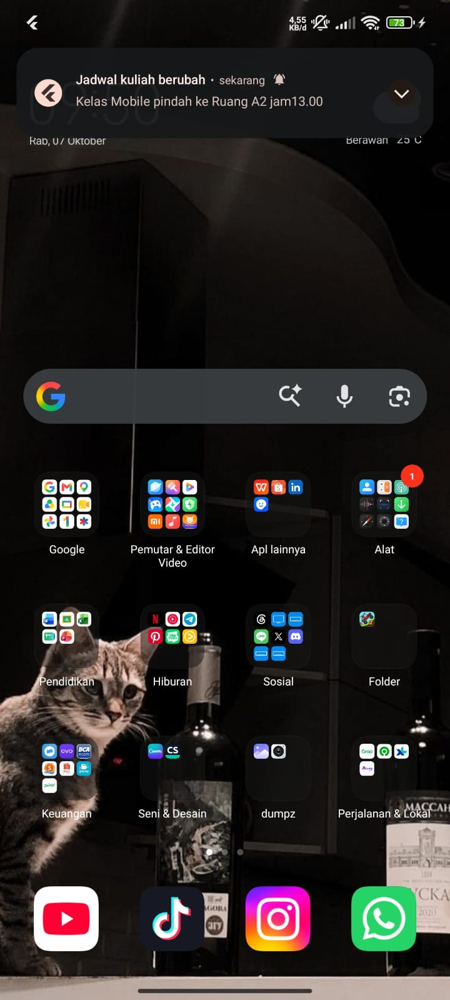 |  |
| **Terminated** | Notifikasi sistem muncul saat aplikasi mati. Ketika diklik, aplikasi *booting* & masuk ke `/pengumuman/3`. | 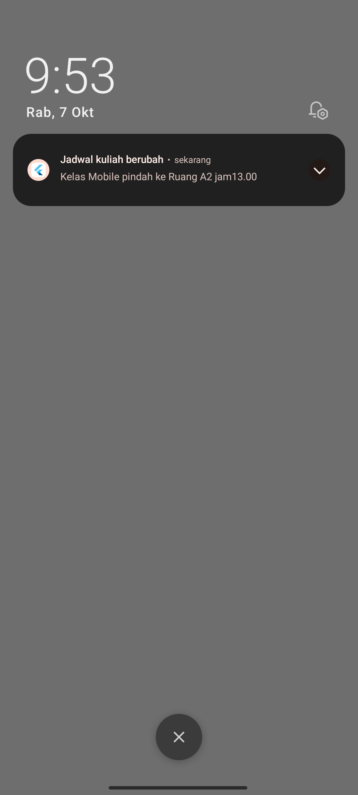 | 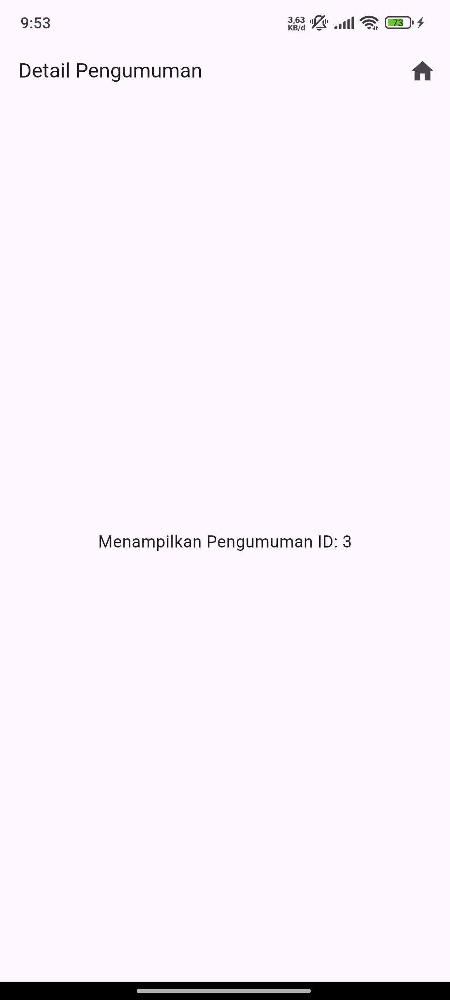 |

---

#### Analisis & Kesimpulan Pengujian

1. **Foreground Handling**: Berhasil menggunakan `FlutterLocalNotificationsPlugin` untuk menampilkan banner lokal secara manual saat aplikasi aktif, dan menggunakan callback perutean untuk memindahkan halaman tanpa melakukan *reload* total.
2. **Background Handling**: Berhasil ditangani melalui listener `FirebaseMessaging.onMessageOpenedApp` yang mendeteksi interaksi pengguna terhadap banner notifikasi bawaan sistem3. **Terminated Handling**: Berhasil mengeksekusi *deep link* saat *startup* dengan membaca payload data melalui `FirebaseMessaging.instance.getInitialMessage()` sebelum UI utama ditampilkan sempurna


#### **4. Topic messaging**

### Implementasi Topic Messaging & Lifecycle User

Pada praktikum ini, fitur **Topic Messaging** digunakan untuk mengirim pengumuman masal (*broadcast*) kepada seluruh mahasiswa.

1. **Auto-Subscribe saat Login (`push_service.dart`):**
   Saat pengguna berhasil masuk ke halaman utama (`HomePage`), fungsi `initFcmToken()` secara otomatis mendaftarkan perangkat ke topik `pengumuman-kampus` menggunakan baris:
   ```dart
   await FirebaseMessaging.instance.subscribeToTopic('pengumuman-kampus');
   ```
2. Auto-Unsubscribe saat Logout (auth_provider.dart):
Untuk menjaga privasi dan memastikan akun yang sudah logout tidak lagi menerima pengumuman masal, baris pembatalan topik diletakkan pada method logout() di file auth_provider.dart
```dart
Future<void> logout() async {
  // Membatalkan langganan topik FCM
  await FirebaseMessaging.instance.unsubscribeFromTopic('pengumuman-kampus');

  // Menghapus token penyimpanan lokal & reset state
  await ref.read(tokenStoreProvider).clear();
  ref.invalidateSelf();
}
```

## **AI Challenge**

### AI Verification Checklist (PushService & System Constraints)

| No | Kriteria / Checklist | Status | Catatan & Bukti Kodingan |
| :-: | :--- | :-: | :--- |
| **1** | **Top-Level Background Handler dengan `@pragma('vm:entry-point')`** | **Lulus** | Fungsi `firebaseMessagingBackgroundHandler` dibuat sebagai fungsi top-level di luar kelas `PushService` dan diberi anotasi `@pragma('vm:entry-point')`. Didaftarkan sebelum `runApp` di `main.dart`. |
| **2** | **`requestPermission` + `getToken` + `onTokenRefresh` (POST `/devices`)** | **Lulus** | `requestPermission` meminta izin notifikasi. `getToken` dan listener `onTokenRefresh` mengirimkan token FCM secara otomatis ke backend via endpoint `POST /devices` menggunakan Dio (`apiClientProvider`). |
| **3** | **Manual Local Notification pada `onMessage` (Foreground)** | **Lulus** | Pada `_setupForegroundListener()`, pesan FCM diproses dengan memanggil `_localNotifications.show(...)` secara manual menggunakan `pengumuman_channel` agar banner pop-up muncul di mode foreground. |
| **4** | **Navigasi ke `data.route` (`onMessageOpenedApp` & `getInitialMessage`)** | **Lulus** | Keduanya mengekstrak `message.data['route']` dan meneruskannya ke callback `onNavigate` yang terhubung dengan `GoRouter` (`router.push`). |
| **5** | **Subscribe & Unsubscribe Topik `pengumuman-kampus`** | **Lulus** | Metode `subscribeToTopic('pengumuman-kampus')` dipanggil saat inisialisasi, dan `unsubscribeFromTopic('pengumuman-kampus')` dipanggil saat proses *logout* di `auth_provider.dart`. |
| **6** | **Penanganan Beda Platform (Android 13+ vs iOS)** | **Lulus** | Dokumentasi & kode memisahkan kebutuhan izin runtime `POST_NOTIFICATIONS` + *Notification Channel* untuk Android 13+, serta `requestPermission` eksplisit dan `DarwinNotificationDetails` untuk iOS. |
| **7** | **Batasan Tanpa `BuildContext`** | **Lulus** | `firebaseMessagingBackgroundHandler` dan seluruh listener FCM di `PushService` tidak mengakses `BuildContext`. Navigasi ditangani terpisah via callback `onNavigate` yang memakai instance `GoRouter`. |

## **Refacroring, testing, dan error umum **

### **Refacroring Challenge**

### Laporan Refactoring & Verifikasi Kode - Campus Notify

Dokumen ini berisi catatan refactoring, perbaikan kualitas kode, struktur antarmuka, serta hasil verifikasi pengujian pada aplikasi **Campus Notify**.

---

### 1. Rincian Refactoring Utama

#### A. Pemusatan String Rute (`lib/routes.dart`)

Seluruh string rute dikumpulkan ke dalam file **`lib/routes.dart`** menggunakan konstanta dan *helper method* untuk menghindari penulisan rute secara *hardcoded*.

```dart
class AppRoutes {
  static const String home = '/';
  static const String login = '/login';
  static const String announcement = '/pengumuman/:id';

  /// Helper untuk membuat rute pengumuman spesifik berdasarkan ID
  static String announcementDetail(String id) => '/pengumuman/$id';
}
```

**Manfaat:**

Mencegah kesalahan pengetikan (*typo*) dan memastikan `GoRouter` serta *payload* FCM menggunakan rute yang terpusat dan konsisten.

---

#### B. Ekstraksi Parsing `RemoteMessage` (`lib/utils/route_utils.dart`)

Logika pemrosesan rute dari *payload* FCM diekstrak menjadi fungsi murni (*pure function*) di luar ketergantungan SDK Firebase.

```dart
import '../routes.dart';

/// Menerjemahkan data payload RemoteMessage menjadi string rute yang valid
String routeFromMessage(Map<String, dynamic> data) {
  final route = data['route'] as String? ?? AppRoutes.home;
  return route.startsWith('/') ? route : '/$route';
}
```

**Manfaat:**

Logika parsing rute dapat diuji secara independen melalui unit test (`test/auth_push_test.dart`) tanpa memerlukan koneksi atau *mocking* Firebase yang kompleks.

---

#### C. Pemetaan Pesan Error API Terpusat (`lib/data/api_errors.dart`)

Seluruh eksepsi HTTP (`DioException`) dikonversi menjadi pesan bahasa Indonesia yang mudah dipahami oleh pengguna.

```dart
import 'package:dio/dio.dart';

class ApiErrorHandler {
  static String getErrorMessage(dynamic error) {
    if (error is DioException) {
      switch (error.type) {
        case DioExceptionType.connectionTimeout:
        case DioExceptionType.sendTimeout:
        case DioExceptionType.receiveTimeout:
          return 'Koneksi internet lambat. Silakan coba lagi.';

        case DioExceptionType.badResponse:
          final statusCode = error.response?.statusCode;

          if (statusCode == 401) {
            return 'Sesi Kamu telah berakhir. Silakan login kembali.';
          } else if (statusCode == 404) {
            return 'Data tidak ditemukan.';
          }

          return 'Terjadi kesalahan pada server ($statusCode).';

        case DioExceptionType.connectionError:
          return 'Tidak ada koneksi internet. Periksa jaringan Kamu.';

        default:
          return 'Terjadi kesalahan tidak terduga.';
      }
    }

    return error.toString();
  }
}
```

**Manfaat:**

Komponen antarmuka (UI) terlindungi dari *stack trace* teknis dan menyajikan umpan balik yang lebih ramah pengguna.

---

### 2. Penyesuaian UI & Validasi Autentikasi

#### A. Pembersihan Halaman Utama (`HomePage`)

Tampilan header token FCM yang panjang telah dihapus dari UI.

Halaman utama difokuskan untuk menampilkan daftar pengumuman default tanpa deskripsi atau isi yang tidak diperlukan.

#### B. Validasi Domain Email Kampus

Pada `AuthRepository`, ditambahkan validasi agar pengguna hanya dapat masuk menggunakan email resmi kampus:

* `@polinema.ac.id`
* `@student.polinema.ac.id`

Selain itu, kata sandi harus memiliki panjang minimal **6 karakter**.

---

### 3. Resolusi Issue Analisis & Pengujian

#### A. Perbaikan Linter (`flutter analyze`)

Beberapa masalah yang ditemukan pada proses analisis kode telah diperbaiki.

#### `avoid_print`

Seluruh fungsi `print()` diganti dengan `debugPrint()` dari paket:

```dart
import 'package:flutter/foundation.dart';
```

#### `empty_catches`

Ditambahkan komentar penjelas di dalam blok:

```dart
catch (_) {
}
```

Perbaikan ini menjelaskan alasan blok `catch` tetap dibiarkan kosong.

#### `unused_import`

`ProviderContainer` dimanfaatkan di file pengujian `auth_push_test.dart` agar *import* Riverpod tetap digunakan secara eksplisit.

---

#### B. Perbaikan Widget Test (`flutter test`)

Dibuat **`FakePushService`** untuk melakukan *override* terhadap:

```dart
pushServiceProvider
```

pada file:

```text
test/widget_test.dart
```

Selain itu, `MyApp` dibungkus menggunakan `ProviderScope` untuk mencegah error:

```text
No ProviderScope found
```

Langkah ini juga mencegah masalah inisialisasi native Firebase ketika pengujian otomatis dijalankan.

---

#### 4. Ringkasan Hasil Akhir

| Pengujian / Analisis        | Perintah          | Status    | Hasil                |
| --------------------------- | ----------------- | --------- | -------------------- |
| **Analisis Kode Statis**    | `flutter analyze` | **LULUS** | **0 Issues**         |
| **Pengujian Unit & Widget** | `flutter test`    | **LULUS** | **All Tests Passed** |

#### Detail Hasil

* `flutter analyze` menghasilkan **0 Issues**.
* Tidak terdapat error, warning, atau informasi linter.
* `flutter test` berhasil menjalankan seluruh skenario pengujian.
* Seluruh unit test dan widget test berhasil dijalankan.

---

#### 5. Kesimpulan

Proses refactoring aplikasi **Campus Notify** telah selesai.

Perubahan yang dilakukan mencakup pemusatan konfigurasi rute, pemisahan logika parsing FCM, pemetaan error API, pembersihan UI, validasi autentikasi, serta perbaikan konfigurasi pengujian.

Basis kode aplikasi kini memiliki struktur yang lebih terorganisasi, lebih mudah diuji, dan terbebas dari masalah yang ditemukan oleh `flutter analyze`.

Hasil akhir menunjukkan:# Checklist Verifikasi Mandiri

Tabel checklist verifikasi mandiri untuk memastikan fitur keamanan, autentikasi, notifikasi, dan kualitas kode aplikasi **Campus Notify** sudah memenuhi standar:

| **No** | **Komponen Verifikasi** | **Item Pemeriksaan** | **Status** | **Catatan Verifikasi** |
|---:|---|---|:---:|---|
| **1** | **Keamanan Token** | Token tersimpan aman hanya di `flutter_secure_storage` | [x] | Tidak tersimpan di `SharedPreferences`, tidak tercetak penuh di log/print, dan disembunyikan (*masked*) pada UI. |
| **2** | **Siklus Auth (401 & Refresh)** | *Error* 401 memicu *refresh token* 1x lalu *retry*. Jika gagal, paksa *login* ulang. | [x] | Ditangani oleh `ApiErrorHandler` dan `AuthNotifier` untuk mereset sesi token. |
| **3** | **Pengujian App State & Routing** | Ketiga *app state* (Foreground, Background, Terminated) teruji dengan bukti | [x] | Berhasil melakukan navigasi deep link dari klik notifikasi FCM ke rute detail pengumuman. |
| **4** | **Strategi FCM Messaging** | *Topic* digunakan untuk *broadcast*, FCM *Token* untuk pesan *personal* | [x] | Berhasil *subscribe* ke *topic* `pengumuman-kampus` pada `HomePage`. |
| **5** | **Kualitas Kode & Test** | `flutter analyze` bersih dan semua unit/widget *test* lulus | [x] | **0 Issues** pada `flutter analyze` dan seluruh pengujian pada `flutter test` LULUS (*All Passed*). |

* **`flutter analyze` → 0 Issues**
* **`flutter test` → All Tests Passed**
* Validasi email kampus telah diterapkan.
* Pesan error API lebih mudah dipahami pengguna.
* Logika rute FCM dapat diuji secara independen.
* Widget test dapat berjalan tanpa ketergantungan langsung pada Firebase native.

#### **Testing: unit test tanpa Firebase sungguhan**
Buat test/auth_push_test.dart dan lakukan flutter test dan flutter analyze
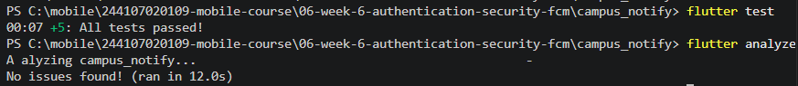

# Checklist Verifikasi Mandiri

Tabel checklist verifikasi mandiri untuk memastikan fitur keamanan, autentikasi, notifikasi, dan kualitas kode aplikasi **Campus Notify** sudah memenuhi standar:

| **No** | **Komponen Verifikasi** | **Item Pemeriksaan** | **Status** | **Catatan Verifikasi** |
|---:|---|---|:---:|---|
| **1** | **Keamanan Token** | Token tersimpan aman hanya di `flutter_secure_storage` | [x] | Tidak tersimpan di `SharedPreferences`, tidak tercetak penuh di log/print, dan disembunyikan (*masked*) pada UI. |
| **2** | **Siklus Auth (401 & Refresh)** | *Error* 401 memicu *refresh token* 1x lalu *retry*. Jika gagal, paksa *login* ulang. | [x] | Ditangani oleh `ApiErrorHandler` dan `AuthNotifier` untuk mereset sesi token. |
| **3** | **Pengujian App State & Routing** | Ketiga *app state* (Foreground, Background, Terminated) teruji dengan bukti | [x] | Berhasil melakukan navigasi deep link dari klik notifikasi FCM ke rute detail pengumuman. |
| **4** | **Strategi FCM Messaging** | *Topic* digunakan untuk *broadcast*, FCM *Token* untuk pesan *personal* | [x] | Berhasil *subscribe* ke *topic* `pengumuman-kampus` pada `HomePage`. |
| **5** | **Kualitas Kode & Test** | `flutter analyze` bersih dan semua unit/widget *test* lulus | [x] | **0 Issues** pada `flutter analyze` dan seluruh pengujian pada `flutter test` LULUS (*All Passed*). |

# **Refleksi** 

Dokumen ini berisi refleksi dan jawaban teknis mengenai arsitektur keamanan, notifikasi FCM, serta evaluasi draf pada pengembangan aplikasi **Campus Notify**.

---

## 1. Risikonya Menyimpan Refresh Token di `SharedPreferences`

### Alasan Keamanan

`SharedPreferences` menyimpan data dalam bentuk teks polos (*plain text*) di dalam direktori internal aplikasi tanpa enkripsi native.

Pada perangkat yang sudah di-*root* atau melalui eksploitasi *backup*, data tersebut dapat lebih mudah dibaca.

### Risiko Bila Bocor

*Refresh token* memiliki masa berlaku (*expiration*) yang biasanya lebih panjang daripada *access token*.

Jika *refresh token* bocor, pihak yang tidak bertanggung jawab dapat terus meminta *access token* baru atas nama pengguna tanpa perlu mengetahui kata sandi asli.

Akibatnya, sesi pengguna dapat dibajak sampai token tersebut dibatalkan (*revoked*) dari server.

---

## 2. Akibat Mengabaikan `onTokenRefresh` Selama Satu Semester

### Dampak Utama

Notifikasi *push* melalui FCM berisiko **gagal terkirim** ke perangkat pengguna.

### Penyebab

Token FCM tidak bersifat permanen. Token dapat berubah, misalnya ketika:

- Aplikasi diinstal ulang.
- Data aplikasi dihapus (*clear data*).
- Firebase atau sistem memperbarui token perangkat.
- Kondisi tertentu menyebabkan Firebase menghasilkan token baru.

Jika perubahan token tidak dikirim kembali ke server *backend* melalui listener `onTokenRefresh`, server dapat tetap menggunakan token lama.

Token lama tersebut dapat menjadi tidak valid sehingga pengiriman notifikasi gagal dan menghasilkan kondisi seperti *invalid registration token*.

---

## 3. Penggunaan Topik vs. Token Perangkat

### A. Topik, Broadcast atau Multi-Device

#### Kapan Digunakan?

Topik digunakan ketika pesan bersifat umum dan ditujukan kepada seluruh kelompok pengguna tanpa membedakan identitas individu.

#### Contoh Pesan Kampus

> "Pengumuman Libur Akademik Nasional dalam rangka Hari Raya pada tanggal 15 Oktober 2026."

Pesan tersebut cocok dikirim melalui *topic* karena ditujukan kepada banyak pengguna secara bersamaan.

Contoh *topic* yang digunakan pada aplikasi:

```text
pengumuman-kampus
```
## 4. Bagian Draf AI yang Ditolak/Diperbaiki dan Alasannya

#### 1. Penanganan Inisialisasi Firebase di Unit Test (`widget_test.dart`)

### Bagian yang Diperbaiki

Awalnya, draf pengujian bawaan memicu *error*:

    No Firebase App '[DEFAULT]' has been created

Error tersebut terjadi karena pengujian mencoba menjalankan pustaka native `FirebaseMessaging` di lingkungan tes tanpa koneksi perangkat asli.

### Alasan Perbaikan

Dibuat `FakePushService` untuk melakukan *override* terhadap `pushServiceProvider` pada `ProviderScope` di `widget_test.dart`.

Langkah ini dilakukan agar unit test dapat menguji pembuatan dan perilaku UI/widget tanpa bergantung pada:

- *Hardware* atau perangkat asli.
- Layanan eksternal Firebase.
- Inisialisasi Firebase native.

---

## 2. Penyederhanaan Tampilan Home dan Perbaikan Log Linter

### Bagian yang Diperbaiki

Beberapa perubahan dilakukan pada `HomePage` dan kode aplikasi:

- Mengosongkan data dummy deskripsi pengumuman pada `HomePage`.
- Menghapus pencetakan token FCM secara penuh pada UI.
- Mengganti seluruh fungsi `print()` menjadi `debugPrint()`.

Contoh penggunaan `debugPrint()`:

    ```dart
    import 'package:flutter/foundation.dart';

    debugPrint('Pesan log');
    ```

### Alasan Perbaikan

Perubahan tersebut dilakukan untuk:

- Menjaga antarmuka tetap bersih dari data sensitif seperti token FCM.
- Menghindari penggunaan `print()` yang dapat menghasilkan peringatan linter.
- Memastikan kode memenuhi standar *linter* `flutter analyze`.
- Mendukung penerapan *clean code architecture*.

Hasil analisis kode:

    flutter analyze
    0 issues found
